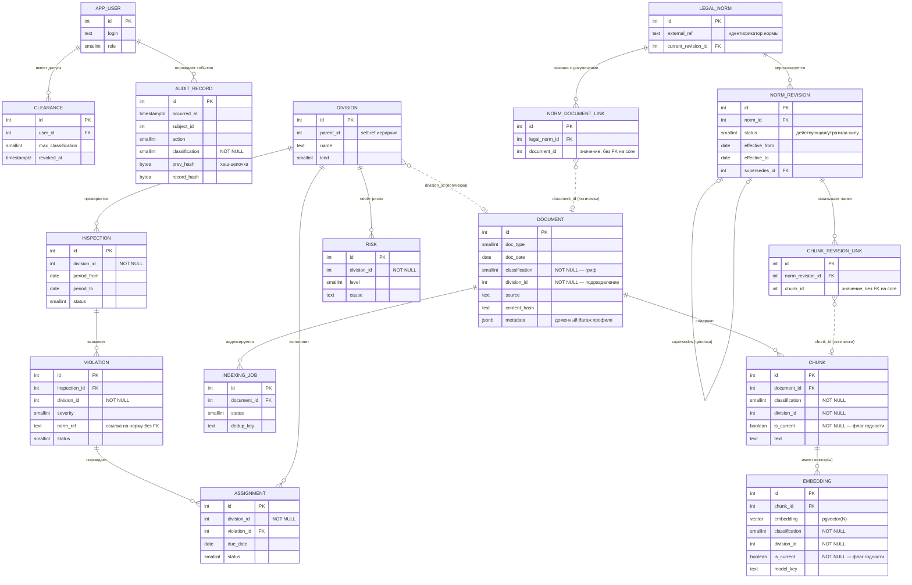

# ДОК-04. Описание схемы данных ISC.AI

| Документ | Система | Версия | Статус | Связь с ТЗ (ключевые ID) |
|---|---|---|---|---|
| ДОК-04. Описание схемы данных (ER-модель обоих контекстов, словарь метаданных, модель версионности редакций) | ISC.AI («ИнспекторAI») | 0.1 (черновик) | На рассмотрении | ТО-инф-01, ТО-инф-02, ТО-инф-03, ТО-инф-04, ТО-инф-05, ТО-инф-06, ТО-инф-07; ТБ-002, ТБ-020, ТБ-021, ТБ-022, ТБ-023, ТБ-024, ТБ-030, ТБ-031, ТБ-032, ТБ-033, ТБ-062, ТБ-064; ТО-прог-01, ТО-прог-08; ТС-005, ТНД-002; GATE-1, GATE-3, КИ-02 |

> **Назначение документа.** ДОК-04 описывает целевую схему хранения данных платформы ISC.AI: организацию единой базы PostgreSQL в двух схемах (`core` / `inspector`), ER-модель сущностей каждого контекста и связи между ними, словарь обязательных метаданных документа/чанка/эмбеддинга, модель версионности редакций НПА, паттерн согласованности через границу схем, схему индексации (включая векторный поиск pgvector с фильтром по грифу), порядок миграций и требования к защите данных at-rest и гарантированному удалению. Документ детализирует требования раздела 5.3.2 ТЗ (информационное обеспечение) и реализует режимные инварианты раздела 5.1.6.
>
> Схема РЕАЛИЗОВАНА (Э3-01/Э3-02: `CoreDbContext` — схема `core`, `InspectorDbContext` — схема `inspector`, pgvector, snake_case; у каждого контекста своя история миграций) и с тех пор развивается миграциями вместе с модулями (документооборот — схема `docflow`, Э4-35; учёт нарушений, реестр методик, тип подразделения — Э5). **Источник истины по фактическому состоянию — код**: `src/core/ISC.AI.Persistence`, `src/profiles/inspector/ISC.AI.Profile.Inspector.Data` (папки `Migrations/`). Документ сохраняет проектную ER-модель и словарь метаданных как замысел; при расхождении деталей (имена колонок, типы) верить миграциям. (Сверка 2026-08-25.)

---

## Содержание

1. [Общая модель хранения](#1-общая-модель-хранения)
2. [ER-модель схемы `core`](#2-er-модель-схемы-core)
3. [ER-модель схемы `inspector`](#3-er-модель-схемы-inspector)
4. [Сводная ER-диаграмма (Mermaid)](#4-сводная-er-диаграмма-mermaid)
5. [Словарь обязательных метаданных](#5-словарь-обязательных-метаданных)
6. [Модель версионности редакций](#6-модель-версионности-редакций)
7. [Согласованность через границу схем](#7-согласованность-через-границу-схем)
8. [Индексация и векторный поиск](#8-индексация-и-векторный-поиск)
9. [Порядок миграций](#9-порядок-миграций)
10. [Защита at-rest и гарантированное удаление](#10-защита-at-rest-и-гарантированное-удаление)
11. [Открытые вопросы (Э1)](#11-открытые-вопросы-э1)

---

## 1. Общая модель хранения

**1.1. Единая СУБД, две схемы (ТО-инф-01).** Все данные одного экземпляра системы размещаются в **одной базе PostgreSQL**, разделённой на **две схемы**:

- **`core`** — универсальные, доменно-нейтральные таблицы движка: документы, чанки, эмбеддинги, журнал аудита, пользователи и допуски, задания индексации. Корпус нейтрален: ни норм НПА, ни редакций ядро не знает;
- **`inspector`** — доменные сущности профиля «Инспектор»: подразделение, проверка, нарушение, риск, поручение, **а также модель НПА (норма и её редакции)** и связки этой модели с корпусом ядра (см. 3.6–3.8).

Такое разделение отражает архитектурный принцип «нейтральное ядро + сменный профиль» (ТС-003): схема `core` не содержит знаний о конкретном ведомстве, доменная специфика локализована в `inspector`. Замена профиля означает замену схемы `inspector` без изменения `core`.

**1.2. Две независимые истории миграций (ТО-инф-01, ТО-прог-08).** Каждая схема ведёт **собственную историю миграций**. На уровне EF Core это реализуется двумя контекстами данных:

- `CoreDbContext` (проект `ISC.AI.Persistence`) — таблица истории миграций `core.__ef_migrations_history`;
- `InspectorDbContext` (проект `ISC.AI.Profile.Inspector.Data`) — таблица истории миграций `inspector.__ef_migrations_history`.

Разделение историй позволяет версионировать ядро и профиль независимо и применять миграции в строго заданном порядке (core → inspector, см. раздел 9).

**1.3. Векторное хранилище (ТО-инф-02).** Семантический поиск обеспечивается расширением **pgvector** в той же базе. Эмбеддинги хранятся в таблице схемы `core` в колонке типа `vector(N)`; отдельная векторная СУБД не вводится (соответствует принципу модульного монолита ТС-001 и минимизации компонентов в изолированном контуре). Создание расширения и индексов входит в процедуру первичного развёртывания (ТО-инф-02, ТО-прог-08).

**1.4. Граница экземпляра и атрибут «подразделение» (ТС-005).** Развёртывание — multi-instance: отдельный экземпляр (своя БД) на отдел/контур верхнего уровня. Граница экземпляра — Главная инспекция в целом; подчинённые подразделения (территориальные и линейные) представлены **не отдельными базами, а атрибутом «подразделение»** в данных одного экземпляра. Поэтому колонка `division_id` присутствует в режимных метаданных `core` и является ключевой связью в `inspector`; именно она обеспечивает сводные представления дашборда и архива.

**1.5. Кодировка и базовые соглашения (ориентировочно).**

- Кодировка БД — `UTF8` (обязательна поддержка русского и кыргызского контента, ТО-лнг-01);
- идентификаторы сущностей — `int` (генерация на стороне приложения), что упрощает идемпотентную загрузку и перенос данных;
- временные метки — `timestamptz` (UTC); часовой пояс представления — на стороне UI;
- именование объектов БД — `snake_case` (через `EFCore.NamingConventions`; C#-сущности остаются PascalCase), имена схем — `core` / `inspector`.

---

## 2. ER-модель схемы `core`

Схема `core` содержит универсальные сущности движка (ТО-инф-01). Ниже — назначение сущностей, ключевые атрибуты (типы ориентировочные) и связи.

### 2.1. Документ (`core.document`)

Единица хранения исходного материала (НПА, скан, образец и т. п.).

| Атрибут | Тип (ориентировочно) | Назначение |
|---|---|---|
| `id` | `int` PK | Идентификатор документа. |
| `doc_type` | `text` / `smallint` (справочник) | Тип документа (закон, приказ, положение, инструкция, акт, справка и др.). |
| `title` | `text` | Наименование. |
| `source` | `text` | Источник (происхождение, путь поступления, реквизиты загрузки). |
| `doc_date` | `date` | Дата документа. |
| `classification` | `smallint` (справочник грифов) **NOT NULL** | Гриф (ТБ-002, ТО-инф-03). |
| `division_id` | `int` **NOT NULL** | Подразделение-владелец/принадлежность (ТС-005, ТО-инф-03). |
| `storage_uri` | `text` | Ссылка на исходный файл в защищённом файловом хранилище. |
| `content_hash` | `bytea` / `text` | Хеш содержимого для дедупликации (ТНД-002, ТО-инф-07). |
| `metadata` | `jsonb` (nullable) | Доменно-нейтральный «багаж» атрибутов профиля (для НПА — идентификатор нормы и т. п.). Ядро значения не интерпретирует; доменные сущности профиля (схема `inspector`) ссылаются на документ по `id` без FK через границу схем (ТО-инф-06). |
| `created_at` / `updated_at` | `timestamptz` | Технические метки. |

Связи: `1 — N` к `core.chunk`. Связь с нормой НПА — на стороне профиля (`inspector.norm_document_link`, слабая ссылка по `id` без FK, ТО-инф-06).

### 2.2. Чанк (`core.chunk`)

Фрагмент документа — единица индексации и извлечения.

| Атрибут | Тип | Назначение |
|---|---|---|
| `id` | `int` PK | Идентификатор чанка. |
| `document_id` | `int` FK → `core.document` **NOT NULL** | Родительский документ. |
| `ordinal` | `int` | Порядковый номер фрагмента в документе. |
| `text` | `text` | Текст фрагмента. |
| `classification` | `smallint` **NOT NULL** | Гриф (денормализован для фильтра при извлечении, ТБ-020/024). |
| `division_id` | `int` **NOT NULL** | Подразделение (денормализовано для фильтра, ТБ-020). |
| `is_current` | `boolean` **NOT NULL** (default `true`) | Нейтральный флаг годности источника: фрагмент актуален (не утратил силу). Фильтруется ядровым `IRetriever` по умолчанию и проверяется грунтовкой (ADR-0013). Доменный смысл «актуальности» (для НПА — действующая редакция) материализует профиль. |
| `created_at` | `timestamptz` | Технические метки. |

Денормализация грифа и подразделения на уровень чанка — намеренная: фильтр доступа применяется на этапе извлечения на стороне БД (ТБ-020), и атрибуты должны быть доступны в той же строке, что и вектор, без джойнов через родителя.

Связи: `N — 1` к `core.document`; `1 — 1`/`1 — N` к `core.embedding`. Привязка к редакции НПА — на стороне профиля (`inspector.chunk_revision_link`, слабая ссылка по `id` без FK, ТО-инф-06).

### 2.3. Эмбеддинг (`core.embedding`)

Векторное представление чанка для семантического поиска.

| Атрибут | Тип | Назначение |
|---|---|---|
| `id` | `int` PK | Идентификатор эмбеддинга. |
| `chunk_id` | `int` FK → `core.chunk` **NOT NULL** | Источник вектора. |
| `embedding` | `vector(N)` (pgvector) | Вектор; размерность `N` — по выбранной модели (ТО-прог-03). |
| `model_key` | `text` | Роль/идентификатор модели векторизации (ru/ky), породившей вектор. |
| `classification` | `smallint` **NOT NULL** | Гриф (носитель грифа на самом векторе, ТБ-020). |
| `division_id` | `int` **NOT NULL** | Подразделение (ТБ-020). |
| `is_current` | `boolean` **NOT NULL** (default `true`) | Флаг годности, денормализован на вектор для фильтра актуальности по умолчанию (ADR-0013). |
| `created_at` | `timestamptz` | Технические метки. |

> **Режимный инвариант.** Хранилище эмбеддингов несёт атрибуты грифа и подразделения и подчиняется решётке доступа **при любом обращении**, а не только через штатный retriever (ТБ-020). Поэтому `classification`/`division_id` дублируются на уровне эмбеддинга, и прямой доступ к таблице векторов проверяется отдельным тестом (GATE-1, подпроверка прямого доступа к таблице эмбеддингов).

Связи: `N — 1` (или `1 — 1`) к `core.chunk`.

### 2.4. (перенесено) Модель НПА — в схеме `inspector`

Норма НПА и её редакции — **доменная модель профиля**, а не ядра: они описаны в схеме `inspector` (см. 3.6–3.7), а их связь с нейтральным корпусом ядра — через таблицы-связки `inspector.norm_document_link` / `inspector.chunk_revision_link` (см. 3.8), хранящие `document_id`/`chunk_id` **значением, без FK** через границу схем (ТО-инф-06). Вместо статуса редакции ядро держит нейтральный флаг годности `core.chunk.is_current` (раздел 6).

### 2.5. Запись аудита (`core.audit_record`)

Неизменяемый журнал действий (ТБ-030, ТБ-031, ТБ-032).

| Атрибут | Тип | Назначение |
|---|---|---|
| `id` | `bigint` (sequence) PK | Идентификатор записи. Монотонный порядок даёт `bigint`-последовательность; неизменность и упорядочение цепочки обеспечиваются полями `prev_hash`/`record_hash` и `occurred_at`, а не типом PK (int не монотонен и для этой цели не используется). |
| `occurred_at` | `timestamptz` **NOT NULL** | Время события. |
| `subject_id` | `int` | Субъект (пользователь). |
| `action` | `text` / `smallint` | Действие (вход, просмотр, поиск, генерация, экспорт, печать, выгрузка). |
| `object_ref` | `text` | Идентификаторы затронутых объектов. |
| `classification` | `smallint` **NOT NULL** | Гриф события/объекта. |
| `division_id` | `int` (nullable) | Подразделение события/объекта — для применения решётки «гриф × подразделение» к доступу к самому журналу (ТБ-002, ТБ-032). |
| `payload_sensitive` | `text` (nullable, под решёткой) | Чувствительное содержимое (тексты промптов/выводов, наименования ДСП) — отделено от метаданных (ТБ-032). |
| `prev_hash` | `bytea` | Хеш предыдущей записи (хеш-цепочка, ТБ-031). |
| `record_hash` | `bytea` | Хеш текущей записи. |

> **Режимные инварианты аудита.** Журнал — **append-only**: роль БД, под которой работает приложение, не имеет прав `UPDATE`/`DELETE` на эту таблицу (ТБ-031). Запись содержит **хеш-цепочку** (`prev_hash` → `record_hash`) для обнаружения подмены. Разделение «метаданные события / чувствительное содержимое» (`payload_sensitive` под решёткой доступа, доступ ограничивается по грифу **и подразделению** через `classification`/`division_id`) реализует ТБ-032: роль ИБ-аудита видит факт и метаданные, но не содержимое выше своего допуска. **Сохранённые промпты/выводы ИИ** (которые ТБ-032 называет отдельным производным носителем) хранятся именно в `payload_sensitive` этой таблицы — отдельной сущности под них нет; их срок хранения и удаление/обезличивание (ТБ-043, ТБ-064) применяются к этому полю. Периодическое якорение журнала вовне административного контроля админа БД (ТБ-031) — организационно-процедурная мера, на схему данных влияет лишь наличием хеша-якоря.

### 2.6. Пользователь / Допуск (`core.app_user`, `core.clearance`)

Субъект доступа и его допуск (вход для решётки ТБ-002, ТБ-011, ТБ-012).

`core.app_user`: `id int PK`, `login text`, `display_name text`, `role smallint` (инспектор/руководство/администратор, ТП-001), `is_active boolean`.

`core.clearance` (допуски пользователя): `id int PK`, `user_id int FK`, `max_classification smallint` (максимальный доступный гриф), `division_scope` (область подразделений), `granted_at`/`revoked_at timestamptz`.

> Допуск пользователя — **обязательный вход** для фильтра доступа при извлечении (ТБ-012): без установленного субъекта с допуском операции извлечения не выполняются (fail-closed, ТБ-021). Отзыв допуска (`revoked_at`) вступает в силу для retrieval немедленно (ТБ-016). Сама решётка «гриф × роль × подразделение → разрешение» (ТБ-002) может храниться как конфигурация/справочник; её предметное наполнение уточняется на Э1.

### 2.7. Задание индексации (`core.indexing_job`)

Управление фоновой загрузкой/переиндексацией (ТНД-001, ТНД-002, ТО-инф-07).

| Атрибут | Тип | Назначение |
|---|---|---|
| `id` | `int` PK | Идентификатор задания. |
| `document_id` | `int` FK → `core.document` (nullable) | Целевой документ. |
| `status` | `smallint` | Состояние (поставлено/выполняется/завершено/ошибка). |
| `attempts` | `int` | Счётчик попыток (идемпотентность, ТНД-002). |
| `dedup_key` | `text` | Ключ дедупликации (повторный запуск не создаёт дублей, ТНД-002). |
| `created_at` / `finished_at` | `timestamptz` | Технические метки. |

Сбой задания не должен влиять на интерактивную часть (ТНД-001); незавершённые задания не теряются сверх RPO (ТНД-005).

---

## 3. ER-модель схемы `inspector`

Схема `inspector` содержит доменные сущности профиля «Инспектор» (ТО-инф-05). Минимальный состав: Подразделение, Проверка, Нарушение, Риск, Поручение — со связями к подразделению, срокам и статусам. ER-модель уточняется на Э1.

### 3.1. Подразделение (`inspector.division`)

Объект контроля (территориальные и линейные подразделения, вплоть до райотдела; точная иерархия — Э1).

| Атрибут | Тип | Назначение |
|---|---|---|
| `id` | `int` PK | Идентификатор подразделения. **Соответствует `division_id`** в режимных метаданных `core` (логическая, а не FK-связь, см. раздел 7). |
| `parent_id` | `int` (nullable, self-ref) | Иерархия (ТУ → райотдел и т. п.). |
| `name` | `text` | Наименование. |
| `kind` | `smallint` | Тип (территориальное / линейное). |

### 3.2. Проверка (`inspector.inspection`)

| Атрибут | Тип | Назначение |
|---|---|---|
| `id` | `int` PK | Идентификатор проверки. |
| `division_id` | `int` **NOT NULL** | Проверяемое подразделение. |
| `period_from` / `period_to` | `date` | Период проверки. |
| `status` | `smallint` | Статус. |
| `summary` | `text` | Краткое описание/итоги. |

Связи: `1 — N` к `inspector.violation`.

### 3.3. Нарушение (`inspector.violation`)

| Атрибут | Тип | Назначение |
|---|---|---|
| `id` | `int` PK | Идентификатор нарушения. |
| `inspection_id` | `int` FK → `inspector.inspection` **NOT NULL** | Проверка-источник. |
| `division_id` | `int` **NOT NULL** | Подразделение (для фильтрации/аналитики). |
| `severity` | `smallint` | Тяжесть. |
| `norm_ref` | `text` (nullable) | Ссылка на норму НПА (по `external_ref`/`norm_id`, **без FK** в `core`). |
| `status` | `smallint` | Статус устранения. |
| `description` | `text` | Описание. |

Связи: `N — 1` к `inspector.inspection`; `1 — N` к `inspector.assignment` (поручения по устранению).

### 3.4. Риск (`inspector.risk`)

| Атрибут | Тип | Назначение |
|---|---|---|
| `id` | `int` PK | Идентификатор риска. |
| `division_id` | `int` **NOT NULL** | Подразделение. |
| `level` | `smallint` | Уровень критичности. |
| `cause` | `text` | Причины. |
| `recommendation` | `text` | Рекомендации. |
| `updated_at` | `timestamptz` | Постоянное обновление реестра (ТФ-РСК-01). |

### 3.5. Поручение (`inspector.assignment`)

| Атрибут | Тип | Назначение |
|---|---|---|
| `id` | `int` PK | Идентификатор поручения. |
| `division_id` | `int` **NOT NULL** | Подразделение-исполнитель. |
| `violation_id` | `int` FK → `inspector.violation` (nullable) | Связанное нарушение. |
| `due_date` | `date` | Контрольный срок (для сигналов о просрочке, ТФ-МОН-01). |
| `status` | `smallint` | Статус исполнения. |
| `progress` | `text` / `smallint` | Прогресс устранения. |

Связи: `N — 1` к `inspector.violation`; `N — 1` (логически) к `inspector.division`.

### 3.6. Норма НПА (`inspector.legal_norm`)

Доменная модель профиля: устойчивая норма (например, «Закон N…», «Приказ N…»). Перенесена из ядра (была `core.legal_norm`), поскольку понятие НПА специфично для профиля «Инспектор», а не для нейтрального ядра.

| Атрибут | Тип | Назначение |
|---|---|---|
| `id` | `int` PK | Идентификатор нормы (стабильный во времени). |
| `external_ref` | `text` **NOT NULL** | Реквизиты/номер НПА (на него ссылается грунтовка профиля). |
| `title` | `text` | Наименование. |
| `current_revision_id` | `int` FK → `inspector.norm_revision` (nullable) | Указатель на действующую редакцию (быстрый доступ; истина статуса — в самой редакции). |

### 3.7. Редакция НПА (`inspector.norm_revision`)

| Атрибут | Тип | Назначение |
|---|---|---|
| `id` | `int` PK | Идентификатор редакции. |
| `norm_id` | `int` FK → `inspector.legal_norm` **NOT NULL** | Норма-родитель (FK **внутри** схемы `inspector`). |
| `status` | `smallint` **NOT NULL** | Статус: `действующая` / `утратила силу` (ТО-инф-04). |
| `effective_from` | `date` | Дата вступления в силу. |
| `effective_to` | `date` (nullable) | Дата утраты силы (для действующей — `NULL`). |
| `supersedes_id` | `int` FK → `inspector.norm_revision` (nullable) | Предыдущая редакция в цепочке. |

Связи: `inspector.legal_norm 1 — N inspector.norm_revision`; self-ref `supersedes_id` — цепочка редакций. Все FK — **внутри** схемы `inspector`.

### 3.8. Связки с корпусом ядра (`inspector.norm_document_link`, `inspector.chunk_revision_link`)

Восстанавливают связь доменной модели НПА с нейтральным корпусом ядра **без FK через границу схем** (ТО-инф-06): идентификаторы ядра хранятся значением.

`inspector.norm_document_link`: `id int PK`, `legal_norm_id int FK → inspector.legal_norm`, `document_id int` (**значение**, ссылка на `core.document.id` без FK).

`inspector.chunk_revision_link`: `id int PK`, `norm_revision_id int FK → inspector.norm_revision`, `chunk_id int` (**значение**, ссылка на `core.chunk.id` без FK).

> **Материализация годности.** Когда редакция получает статус «утратила силу», профиль в той же транзакции выставляет `core.chunk.is_current = false` для связанных чанков (по `chunk_revision_link`). Так доменная версионность профиля материализуется в нейтральный флаг ядра, который проверяют `IRetriever` и грунтовка (раздел 6, ADR-0013). При гарантированном удалении носителя в ядре (ТБ-064) профиль в той же транзакции удаляет осиротевшие строки связок (раздел 7).

> **Важно (граница схем).** FK-связи существуют только **внутри** одной схемы. Связи `inspector.*` → `core.*` (например, ссылка нарушения на норму НПА, привязка к подразделению как режимному атрибуту) выражаются значением идентификатора **без внешнего ключа БД** между контекстами (ТО-инф-06, см. раздел 7).

---

## 4. Сводная ER-диаграмма (Mermaid)

Диаграмма отражает обе схемы. Связи между `core` и `inspector` показаны пунктиром — это **логические** связи по идентификатору, не FK базы данных (ТО-инф-06).



> Примечание к нотации: имена сущностей на диаграмме даны прописными для краткости и соответствуют таблицам `core.*` и `inspector.*` из разделов 2–3. Пунктирные связи (`..`) — кросс-контекстные ссылки по идентификатору, реализуемые без внешнего ключа БД (ТО-инф-06).

---

## 5. Словарь обязательных метаданных

Реализует **ТО-инф-03** и поддерживает fail-closed загрузку (**ТБ-024**) и решётку доступа (**ТБ-002**). Перечисленные поля закладываются с самого начала; добавление их задним числом считается недопустимым по умолчанию (ТО-инф-03).

| Метаданное | Колонка (ориентир.) | Уровень (документ / чанк / эмбеддинг) | Тип (ориентир.) | Обязательность | Назначение и связь с ТЗ |
|---|---|---|---|---|---|
| Тип документа | `doc_type` | документ | `smallint`/`text` (справочник) | желательно NOT NULL | Классификация материала (ТО-инф-03). |
| Дата | `doc_date` | документ | `date` | по правилам типа | Дата документа (ТО-инф-03). |
| Годность источника | `is_current` | чанк | `boolean` (default `true`) | **NOT NULL** | Нейтральный флаг: фрагмент актуален (не утратил силу). Фильтр `IRetriever` и грунтовка ядра (ADR-0013). Доменную «действующую редакцию» материализует профиль (ТО-инф-04, GATE-3). |
| Редакция / статус (НПА) | `inspector.norm_revision` | профиль (схема `inspector`) | — | доменное | Версионность НПА — модель профиля, не ядра; связь с корпусом — через `chunk_revision_link` (3.8). |
| **Подразделение** | `division_id` | документ, чанк, эмбеддинг | `int` | **NOT NULL** | Принадлежность; вход решётки доступа и фильтра извлечения (ТО-инф-03, ТБ-002, ТБ-020, ТС-005). |
| **Гриф** | `classification` | документ, чанк, эмбеддинг | `smallint` (справочник грифов) | **NOT NULL** | Категория конфиденциальности; несущий режимный атрибут (ТО-инф-03, ТБ-002, ТБ-024). |
| Источник | `source` / `storage_uri` | документ | `text` | желательно | Происхождение материала (ТО-инф-03). |
| Идентификатор нормы (НПА) | `document.metadata` / `inspector.legal_norm.external_ref` | документ (метаданные), профиль | `jsonb` / `text` | доменное | Доменный атрибут профиля: в нейтральном `core.document.metadata` и/или в `inspector.legal_norm`; отдельной колонки в ядре нет. |

**Ключевые инварианты словаря:**

- **Гриф и подразделение — `NOT NULL` на всех трёх уровнях** (документ, чанк, эмбеддинг). Это прямая реализация ТО-инф-03 и техническая опора fail-closed загрузки (ТБ-024): чанк без явно установленных грифа и подразделения **не индексируется** и не попадает в векторное хранилище. Денормализация грифа/подразделения на чанк и эмбеддинг необходима, чтобы фильтр доступа применялся на стороне БД при извлечении и при любом прямом обращении к векторам (ТБ-020).
- **Гриф по умолчанию — максимально ограничительный**, а не открытый (ТБ-024); на уровне схемы это означает отсутствие «открытого» значения по умолчанию и обязательность явной установки оператором.
- **Гриф результата генерации** наследуется как максимум грифов извлечённых фрагментов (ТБ-033) — вычисляется приложением при экспорте; в схеме это поддерживается наличием грифа на каждом чанке/эмбеддинге.

---

## 6. Модель версионности редакций

Реализует **ТО-инф-04** и блокирующий gate-критерий **GATE-3** (увязка с ТФ-НПА-02, КИ-02). Версионность НПА — **доменная модель профиля** (схема `inspector`, см. 3.6–3.8), а не ядра; ядро держит лишь нейтральный флаг годности `core.chunk.is_current`. Грунтовка сама по себе не считается достаточной защитой от этого класса ошибок (ТО-инф-04) — гарантия обеспечивается данными и запросом (флаг годности + ядровой фильтр), а не текстовой проверкой.

**6.1. Цепочка редакций (профиль).** Для каждой нормы (`inspector.legal_norm`) хранится упорядоченная **цепочка редакций** (`inspector.norm_revision`):

- каждая редакция имеет `status` (`действующая` / `утратила силу`), `effective_from`, `effective_to`;
- редакции связаны через `supersedes_id` (новая редакция указывает на ту, что она заменяет);
- норма хранит указатель `current_revision_id` на действующую редакцию (для быстрого доступа), но **истиной статуса является поле `status` самой редакции**.

**6.2. Инвариант «одна действующая» (профиль).** В пределах одной нормы в каждый момент допускается **не более одной** редакции со статусом «действующая». Реализуется частичным уникальным индексом в схеме `inspector`:

```
CREATE UNIQUE INDEX ux_norm_active_revision
  ON inspector.norm_revision (norm_id)
  WHERE status = <ДЕЙСТВУЮЩАЯ>;
```

**6.3. Материализация годности в ядро.** Доменный статус редакции профиль **материализует в нейтральный флаг** `core.chunk.is_current`: при переводе редакции в «утратила силу» профиль в той же транзакции выставляет `is_current = false` для чанков, связанных через `inspector.chunk_revision_link`. Так ядро не знает про НПА, но способно фильтровать неактуальные источники.

**6.4. Гарантия невыдачи утратившей силу как действующей.** Обеспечивается совместно:

- нейтральным флагом `core.chunk.is_current` и фильтром `is_current = true` в `IRetriever` по умолчанию (ядро);
- ядровой грунтовкой, отвергающей ссылку на источник с `is_current = false` (ADR-0013);
- доменной моделью версионности профиля, поддерживающей флаг в актуальном состоянии (`inspector.norm_revision`);
- детерминированным интеграционным тестом GATE-3 (превышение порога КИ-02 — блокирующий дефект). При явном показе утратившая силу редакция помечается «УТРАТИЛА СИЛУ» (ТЭ-003).

**6.5. Связь с переиндексацией и удалением (ТО-инф-07, ТБ-064).** Изменение редакции — это новый документ/чанки с переиндексацией; при отзыве/изменении грифа выполняется гарантированное удаление производных, включая осиротевшие строки связок профиля (см. разделы 7, 10). Переобучение моделей не требуется (ТО-инф-07).

---

## 7. Согласованность через границу схем

Реализует **ТО-инф-06**.

**7.1. Нет внешних ключей между контекстами.** EF Core **не создаёт** внешних ключей между `core` и `inspector`. Кросс-контекстные связи выражаются **значением идентификатора без FK базы данных**: `division_id` как режимный атрибут в `core`, соответствующий `inspector.division.id`; связки модели НПА с корпусом ядра — `inspector.norm_document_link.document_id` → `core.document.id` и `inspector.chunk_revision_link.chunk_id` → `core.chunk.id` (3.8). Это сохраняет независимость контекстов и их историй миграций (раздел 9) и возможность замены профиля.

**7.2. Паттерн целостности (специфицируется в ADR, ТО-инф-06).** На границе схем целостность обеспечивается на **уровне приложения**, а не СУБД:

- проверка существования ссылок на стороне приложения (валидация при записи/использовании);
- паттерн «единица работы» (unit of work) и, где требуется, компенсация при сбоях;
- связки `inspector.norm_document_link` / `inspector.chunk_revision_link` хранят `document_id`/`chunk_id` ядра как «слабые» (по значению) и валидируются при использовании; при гарантированном удалении носителя в ядре (ТБ-064) профиль удаляет осиротевшие строки связок в той же транзакции.

**7.3. Кросс-контекстная атомарность.** Где доменная операция должна быть атомарна с записью аудита (`core.audit_record`), это обеспечивается **общим соединением и транзакцией** обоих контекстов (например, доменная операция профиля + запись аудита ядра выполняются в одной транзакции через разделяемое подключение). Конкретный паттерн фиксируется в ADR (ДОК-06) и проверяется интеграционным тестом (ТО-инф-06).

---

## 8. Индексация и векторный поиск

**8.1. ANN-индекс pgvector (ТО-инф-02).** На колонке `core.embedding.embedding` создаётся приближённый индекс ближайших соседей (ANN) — `HNSW` либо `IVFFlat` (выбор и параметры обосновываются в ADR и зависят от объёма корпуса и метрики расстояния). Метрика расстояния (косинус/`L2`/скалярное) согласуется с моделью эмбеддингов (ТО-прог-03). Пример (ориентировочно):

```
CREATE INDEX ix_embedding_hnsw
  ON core.embedding USING hnsw (embedding vector_cosine_ops);
```

**8.2. Фильтр по грифу и подразделению при поиске (ТБ-020/021/022).** Векторный поиск **всегда** сопровождается фильтром доступа по грифу и подразделению на стороне БД, **до** возврата результатов модели:

- фильтр применяется к `classification`/`division_id` (доступны и на чанке, и на эмбеддинге);
- стратегия фильтрации (pre-filter / post-filter) выбирается так, чтобы **не терять полноту (recall) в пределах допуска** и **не допускать утечки наличия** документов выше допуска (через метаданные, счётчики, ранжирование, время/текст ответа) — обосновывается в ADR (ТБ-022) и проверяется GATE-1;
- при pre-filter создаются вспомогательные B-tree индексы на `classification` и `division_id` (а также частичные/композитные индексы по необходимости) для эффективной совместной работы с ANN-индексом;
- поведение fail-closed (ТБ-021): при отсутствии/неопределённости атрибутов допуска или грифа доступ запрещается.

**8.3. Изоляция грифов (ТБ-023).** Материалы разного грифа не смешиваются в общем индексе без разграничения. Способ изоляции (гарантированная фильтрация в общем индексе либо раздельные индексы/частичные индексы по грифу) обосновывается в модели угроз (ДОК-03) и проверяется тестом изоляции грифов (подпроверка GATE-1).

**8.4. Прочие индексы.** Ориентировочно: B-tree на `core.document(doc_type, doc_date)`; на `core.chunk(document_id)`; на `core.chunk(is_current)` под фильтр годности по умолчанию; индексы связок профиля `inspector.norm_document_link(document_id)` и `inspector.chunk_revision_link(chunk_id)` (привязка к корпусу ядра + очистка осиротевших связок, ТБ-064); уникальный частичный индекс действующей редакции (раздел 6.2, схема `inspector`); индексы на `inspector.*(division_id)`, `inspector.assignment(due_date)` (для сигналов о просрочке), `inspector.violation(status, severity)` (для фильтрации архива/дашборда). Индекс по `content_hash`/`dedup_key` поддерживает идемпотентную дедупликацию (ТНД-002).

---

## 9. Порядок миграций

Реализует **ТО-прог-08** (и поддерживает ТНД-004 — предсказуемость и обратимость миграций в изолированном контуре).

**9.1. Bootstrap расширения.** Первым шагом первичного развёртывания создаётся расширение pgvector:

```
CREATE EXTENSION IF NOT EXISTS vector;
```

Шаг входит в процедуру развёртывания (ТО-инф-02) и предшествует миграциям, создающим таблицу эмбеддингов с типом `vector(N)`.

**9.2. Строгий порядок: core → inspector (ТО-прог-08).** Миграции применяются строго **в порядке `core` → `inspector`**:

1. `CREATE SCHEMA core;` и `CREATE SCHEMA inspector;`
2. `CREATE EXTENSION vector;` (bootstrap);
3. миграции контекста `core` (`CoreDbContext`, история `core.__ef_migrations_history`);
4. миграции контекста `inspector` (`InspectorDbContext`, история `inspector.__ef_migrations_history`).

Такой порядок гарантирует, что универсальные таблицы и расширение существуют до создания доменных таблиц профиля. Поскольку FK между контекстами отсутствуют (ТО-инф-06), порядок диктуется не ссылочной целостностью БД, а зависимостью развёртывания (расширение/схемы должны быть готовы) и принципом «ядро прежде профиля».

**9.3. Офлайн-применение и откат (ТО-прог-08, ТНД-004).** Для изолированного контура миграции поставляются как **идемпотентные SQL-скрипты** с задокументированным порядком применения и **процедурой отката**. Применение и откат отрабатываются на стенде (учебное применение/откат, ТНД-004). Две независимые истории миграций позволяют откатывать профиль, не затрагивая ядро.

---

## 10. Защита at-rest и гарантированное удаление

**10.1. Защита данных at-rest (ТБ-062).** Защита ДСП-данных в покое распространяется на **основную БД и файловое хранилище** (не только на резервные копии):

- шифрование носителей/тома или прозрачное шифрование БД — по политике заказчика и классу защищённости (класс и обязательность СКЗИ уточняются на Э1, ТБ-061);
- **управление ключами — вне БД**;
- разграничение доступа ОС к файлам данных PostgreSQL и к каталогам индексов/эмбеддингов (увязка с ТО-тех-02);
- механизм увязывается с сертифицированными СКЗИ (ТБ-061).

На схему данных это влияет косвенно (выбор тома/каталогов хранения, расположение файлового хранилища исходников `storage_uri`), но является обязательным условием режим-гейта (ТБ-063).

**10.2. Гарантированное удаление производных (ТБ-064).** Предусматривается процедура **гарантированного удаления документа и всех его производных** при отзыве, ошибочной загрузке или изменении грифа. Удаляются согласованно:

- исходный файл (по `storage_uri` в файловом хранилище);
- строки `core.document` и связанные `core.chunk`;
- **эмбеддинги в pgvector** (`core.embedding`) и записи ANN-индекса;
- журнал промптов/выводов ИИ — хранится в поле `payload_sensitive` таблицы `core.audit_record` (отдельной сущности нет, см. §2.5); удаляется/обезличивается там же с учётом срока хранения (ТБ-043, ТБ-032);
- при необходимости — обработка в резервных копиях (по регламенту, ТБ-060).

Удаление фиксируется в аудите (`core.audit_record`, ТБ-030) и увязывается с дедупликацией/версионностью (ТО-инф-07). Удаление производных от документа поддерживается на уровне схемы каскадными связями **внутри `core`** (`document` → `chunk` → `embedding`); межсхемные ссылки удаляются на уровне приложения (нет FK, ТО-инф-06). Тест удаления из всех производных — обязательный (ТБ-064).

> **Связь с режим-гейтом.** Включённая защита at-rest (ТБ-062), append-only аудит с хеш-цепочкой (ТБ-031), fail-closed загрузка (ТБ-024) и проверенные допуски/решётка — обязательные условия организационного режим-гейта (ТБ-063, акт ПОДГ-06) перед обработкой реальных ДСП-данных.

---

## 11. Открытые вопросы (Э1)

Следующие значения и решения **уточняются с заказчиком (Э1)** или фиксируются ADR (ДОК-06):

1. **Реестр грифов и решётка доступа** (ТБ-002): конкретный перечень грифов, их порядок и наполнение решётки «гриф × роль × подразделение → разрешение».
2. **Иерархия подразделений** (ТС-005, ТО-инф-05): точный перечень и иерархия вплоть до райотдела (7 ТУ и 6 линейных — ориентир из презентации).
3. **Размерность вектора `N`, метрика расстояния и тип ANN-индекса** (HNSW/IVFFlat и их параметры) — после выбора и бенчмарка модели эмбеддингов (ТО-прог-03, ТО-лнг-02); фиксируется ADR (ТБ-022).
4. **Стратегия фильтрации векторного поиска** (pre-filter / post-filter) и способ изоляции грифов в индексе — ADR (ТБ-022, ТБ-023), проверка GATE-1.
5. **Паттерн целостности на границе схем** (unit of work / компенсация / проверка ссылок; кросс-контекстная транзакция с аудитом) — ADR (ТО-инф-06).
6. **Класс защищённости информации, обязательность аттестации/сертификации, перечень СрЗИ/СКЗИ**, режим шифрования at-rest и управление ключами (ТБ-061, ТБ-062).
7. **RPO/RTO** и регламент резервного копирования/восстановления, влияние на обработку удаления в резервных копиях (ТНД-003, ТБ-060, ТБ-064).
8. **Стратегия чанкинга** (размер, перекрытие, границы по структуре НПА) — ADR (ТО-мат-03), влияет на `core.chunk` и КИ-03.
9. **Сроки хранения** журнала промптов и производных носителей (ТБ-043).
10. **Окончательные типы колонок СУБД** и справочники (типы документов, статусы, действия аудита) — фиксируются при реализации контекстов данных (Э3).

---

*Статус: черновик (версия 0.1), на рассмотрении. Документ является проектным (целевым): на момент составления реализованы только каркасы проектов `ISC.AI.Persistence` и `ISC.AI.Profile.Inspector.Data` (рабочий этап Э0); схемы, контексты данных и миграции не созданы. ER-модель обоих контекстов, словарь метаданных и модель версионности подлежат уточнению и утверждению на рабочем этапе Э1 (ДОК-04 в составе результатов Э1). Значения, помеченные «уточняется с заказчиком (Э1)», фиксируются на Э1; конкретные типы колонок СУБД приведены ориентировочно.*
