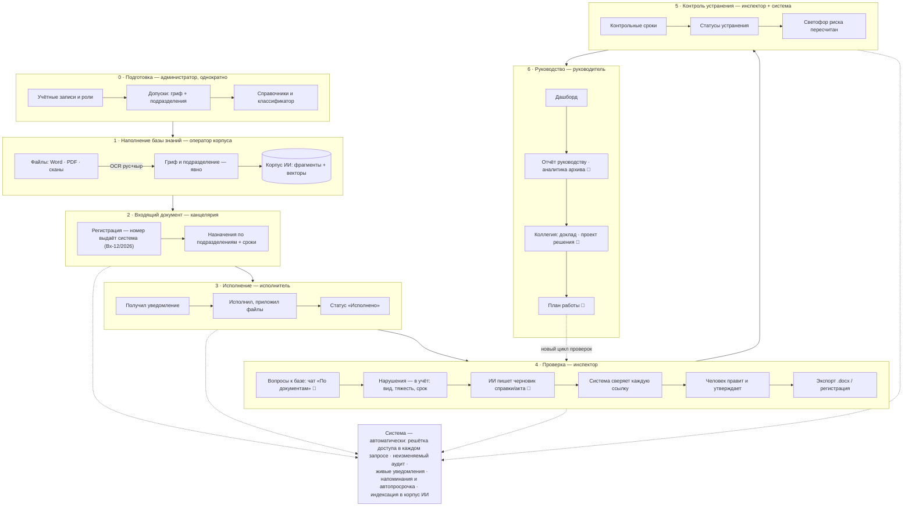

# ИнспекторAI — описание функционала и бизнес-логики (ДОК-11)

> Документ для представления системы заказчику: что она делает, где именно работает ИИ и что
> система гарантирует. Технические подробности — в [архитектуре](02_Архитектура.md) и [ТЗ](ТЗ_ISC.AI.md);
> здесь — деловым языком, без кода. Состояние — на 27.08.2026.

---

## 1. Что это

**ИнспекторAI** — платформа внутреннего контроля с искусственным интеллектом для Главной инспекции.
Она объединяет в одной системе:

- **базу знаний** — нормативные правовые акты (в перспективе ~209 тысяч НПА) и собственные документы
  инспекции, по которым можно искать по смыслу и спрашивать ИИ;
- **документооборот** — регистрация, поручения, сроки, контроль исполнения, отчёты;
- **учёт контрольной работы** — нарушения, риски подразделений, мониторинг устранения, архив проверок;
- **ИИ-помощника** — четырнадцать сценариев, где машина готовит черновики служебных документов,
  анализирует проекты и отвечает на вопросы по документам.

Система работает **полностью внутри закрытого контура, без интернета**: модели ИИ развёрнуты на
собственном сервере, наружу не уходит ни один байт.

## 2. Три принципа, на которых всё построено

**1. ИИ не выдумывает.** Каждая ссылка на статью или норму в ответе ИИ автоматически сверяется
с фрагментами документов, которые система реально нашла и показала модели. Подтверждённая ссылка
помечается как проверенная; ссылка на утратившую силу редакцию — предупреждением «УТРАТИЛА СИЛУ»;
ссылка, которой нет в источниках, — как непроверенная. Документ с непроверенными ссылками
**нельзя зарегистрировать** — система не пропустит.

**2. Числа считает код, ИИ пишет текст.** Во всех отчётах, докладах и планах цифры (нарушения,
просрочки, баллы риска, тренды) считаются детерминированными алгоритмами из живого учёта — те же
числа, что видны на экранах. ИИ только оформляет готовые факты связным текстом. Балл риска
подразделения — формула, а не «мнение нейросети».

**3. Последнее слово — за человеком.** Всё, что генерирует ИИ, — **проект**: на каждом результате
стоит пометка «требует проверки человеком», сроки и пороги в проектах решений ИИ не назначает
(оставляет место «в срок до ______»), утверждение, подпись и регистрация — только человеком.

## 3. Сквозной рабочий процесс

От первого дня до заседания коллегии — кто что делает и где включается ИИ. Пунктиром — то, что
система делает сама на каждом шаге: решётка доступа в каждом запросе, неизменяемый аудит, живые
уведомления, напоминания о сроках и автопросрочка.

Значок 🤖 — шаги, где работает ИИ; на каждом из них действуют принципы раздела 2:
черновик, проверка ссылок, утверждение человеком.

## 4. Функционал — по ходу рабочего дня

### Работа с документами и ИИ

| Модуль | Что делает |
|---|---|
| **Чат-ассистент** | Диалог с ИИ с историей разговоров. Два режима: «По документам» — ответ строится только из найденных в базе фрагментов, со ссылками-источниками; «Свободный чат» — общий разговор, в котором модели прямо запрещено делать юридические утверждения «по памяти». |
| **База НПА** | Поиск по смыслу (не по словам — по значению вопроса) по всему корпусу плюс каталог документов «как в ЦБД Минюста»: отбор по виду акта, статусу действия, карточки документов. |
| **Картотека НПА** | Реестр норм и их редакций. Когда редакция помечается утратившей силу, её фрагменты мгновенно уходят из поиска и из-под пера ИИ — для всех пользователей сразу. |
| **Генератор** | Черновики шести типов служебных документов: справка об итогах проверки, акт проверки, рапорт, докладная записка, заключение, проект приказа. Каждый — со ссылками на правовую базу, прошедшими проверку. |
| **Анализ** | Три инструмента: сравнение НПА по теме (противоречия и пробелы), анализ вставленного документа (правовой/организационный/управленческий) и **сверка проекта документа с действующей базой до подписания** — коллизии и устаревшие ссылки до того, как документ ушёл руководству. |
| **Редактор** | ИИ-правка готового текста по команде («переформулируй строже», «добавь норму о сроках»). Новая редакция целиком проходит ту же проверку ссылок — правка не может протащить выдуманную норму. |
| **Загрузка корпуса** | Пополнение базы знаний: Word, PDF, текст и **сканы** (изображения и PDF со сканера — распознавание на русском и киргизском). Гриф и подразделение оператор указывает явно — «забытый гриф» не превращается в «открыто». Повторная загрузка того же файла не создаёт дублей; новая версия документа гасит прежнюю. |

### Документооборот (канцелярия)

| Возможность | Что делает |
|---|---|
| **Регистрация** | Типы документов двух групп — «хранение» и «исполнение». Регистрационный номер присваивает система из журнала («Вх-12/2026», «Исх-3/2026», «Вн-7/2026» — отдельный счётчик на направление и год); перенесённый из бумажного журнала номер вводится вручную. |
| **Поручения и сроки** | Назначения по подразделениям, единый или индивидуальные сроки, строгая матрица статусов, продление только с основанием и подтверждающими файлами. «Просрочено» ставит **только система** по календарю — вручную статус не подделать. |
| **Уведомления** | Живые уведомления без перезагрузки страницы: назначено, статус изменён, срок приближается, срок сегодня, просрочено, упоминание в комментарии. Никто не получает два уведомления об одном событии. |
| **Карточка документа** | Файлы с версиями отдельно по русскому и киргизскому языку, вложения, комментарии с ветками и упоминаниями коллег, метка «в корпусе ИИ» — виден ли документ ассистенту. |
| **Отчёты** | Шесть видов (по исполнителям, инспекторам, подразделениям, срокам, просроченным, типам) в Excel, Word и PDF. Каждая выгрузка фиксируется в журнале аудита **до** выдачи файла; на PDF наносится имя получателя и время — копия, покинувшая систему, остаётся привязанной к получившему. |

### Контроль и аналитика

| Модуль | Что делает |
|---|---|
| **Дашборд** | Одна страница, две вкладки: «Риски инспекции» (счётчики за период, светофор риска по подразделениям, последние нарушения; фильтры по подразделению, сфере, тяжести, статусу) и «Документооборот» (мои поручения, просрочка, ближайшие сроки). |
| **Учёт нарушений** | Реестр выявленных нарушений: категория (сфера → вид), тяжесть, контрольный срок, справка-проверка, рекомендация. Это первичный источник — от него живут светофор, мониторинг и архив. |
| **Риски** | Балл риска каждого подразделения по открытой формуле (объём и тяжесть открытых нарушений, повторяемость, просрочки, тренд) с разбором «из чего сложился балл». Плюс генерация проекта правил и критериев внутреннего контроля — пороги утверждает человек. |
| **Мониторинг** | Контроль устранения: прогресс по каждому нарушению, эффективность подразделений, аналитический отчёт руководству одной кнопкой. |
| **Архив** | История проверок, сгруппированная по справкам; ИИ-аналитика архива: тренды к прошлому периоду, повторяемость, сравнение территориальных и линейных подразделений — числа считает код за два периода, ИИ интерпретирует. |

### Организационная работа

| Модуль | Что делает |
|---|---|
| **Совещания** | Протоколы как документы «на исполнении»: пункты-поручения, сроки, статусы; справка об исполнении протокола — одной кнопкой. |
| **Коллегия** | Три вида материалов к заседанию: доклад, проект решения (поручения без выдуманных сроков), материалы к совещанию руководства — на одном наборе фактов с отчётом руководству. |
| **Методики** | Программы проверок, чек-листы, инструкции, памятки, учебные материалы — по типу проверки и объекту; проект плана работы инспекции из реальных проблемных зон. Реестр методик — институциональная память: черновик → утверждение руководителем, правка возвращает в черновики. |

### Администрирование

Учётные записи (временный пароль показывается один раз, при первом входе — обязательная смена),
роли (Администратор/Руководитель/Инспектор/Исполнитель), **допуски** (максимальный гриф + список
разрешённых подразделений), справочники территориальных и линейных подразделений, классификатор
нарушений, журнал аудита.

## 5. Где именно работает ИИ

Четырнадцать сценариев. В каждом — одинаковый конвейер: поиск фрагментов по допуску пользователя →
генерация → автоматическая проверка каждой ссылки → пометка «требует проверки человеком».

| Сценарий | Роль модели | Что делает ИИ | Что считает код |
|---|---|---|---|
| Чат «По документам» | быстрая | отвечает по найденным фрагментам, со ссылками | подбор фрагментов, проверка ссылок |
| Свободный чат | быстрая | общий разговор без юридических утверждений | запрет фактов «по памяти» — системным правилом |
| Генератор (6 типов документов) | быстрая | текст черновика по жанровому шаблону | извлечение норм, проверка ссылок, гриф |
| Методические документы (5 видов) | быстрая | текст программы/чек-листа/инструкции | запрос норм по типу проверки и объекту |
| План работы инспекции | быстрая | раскладывает проблемные зоны в план | сами проблемные зоны — из живого учёта |
| Материалы коллегии (3 вида) | быстрая | связующий текст под структуру вида | все числа периода |
| Отчёт руководству | быстрая | связующий текст | все числа устранения и дисциплины |
| Справка по протоколу совещания | быстрая | текст с эскалацией по просроченным | состояние пунктов — из документооборота |
| Правила внутреннего контроля | быстрая | оформляет положение | показатели; пороги оставлены человеку |
| ИИ-редактор | быстрая | новая редакция по команде | повторная проверка всех ссылок |
| Аналитика архива | вдумчивая | интерпретирует закономерности | тренды за два периода, разрез терр./лин. |
| Анализ документа | вдумчивая | правовой/организационный/управленческий разбор | подбор норм по предмету документа |
| Сверка проекта с базой | вдумчивая | заключение: коллизии, устаревшие ссылки | расширенное извлечение норм |
| Сравнение НПА по теме | вдумчивая | противоречия и пробелы между актами | извлечение норм разных актов |

«Быстрая» роль отвечает за секунды; «вдумчивая» — рассуждающая, для аналитики (ответ занимает
минуты). Обе — локальные модели; какие именно — задаётся конфигурацией, система от названий
моделей не зависит. Поиск по смыслу обеспечивает третья, отдельная модель (векторные представления).

## 6. Режим и безопасность

- **Закрытый контур.** Ни одного обращения во внешние сети — ни у приложения, ни у моделей.
  Обновления пакетов и языковых файлов OCR переносятся через периметр по регламенту, с контролем
  целостности каждой единицы (SHA-256).
- **Решётка доступа.** Документ виден, только если его гриф не выше допуска сотрудника **и**
  подразделение документа входит в список разрешённых. Правило применяется в самом запросе к базе —
  на списках, счётчиках, отчётах, уведомлениях и у ИИ одинаково. Недоступный документ неотличим
  от несуществующего — система не подтверждает сам факт его существования.
- **Fail-closed.** Всё, что не разрешено явно, — запрещено: документ без грифа не индексируется,
  пустой список подразделений означает «ничего», а не «всё», чат без опознанного пользователя
  не работает.
- **Неизменяемый аудит.** Каждое обращение, генерация, выгрузка отчёта и выдача файла пишутся
  в журнал, защищённый хеш-цепочкой (подмена записи ломает цепочку). Даже администратор не видит
  в журнале записей выше своего допуска. Чтение журнала само попадает в журнал.
- **Гриф наследуется.** Гриф ответа ИИ равен максимальному грифу использованных фрагментов;
  экспортируемый документ несёт маркировку грифа и пометку «черновик».

## 7. Цифры

- ~60 000 строк кода, 11 функциональных модулей профиля + пакет документооборота;
- ~360 автоматических тестов + интеграционные проверки на настоящей БД, включая проверки
  безопасности: «фильтр доступа не пропускает чужое», «грунтовка ловит выдуманную ссылку»,
  «отчёт не выдаёт того, чего не выдаёт список»;
- поиск по корпусу — доли секунды; конфигурация векторного индекса выверена под рост корпуса
  до сотен тысяч документов;
- полный комплект документации по ГОСТ 34: ТЗ, архитектура, модель угроз, схема данных,
  руководства администратора и пользователя, программа и методика испытаний.

## 8. Готовность

Функциональные требования ТЗ (§5.2) реализованы полностью. До ввода в эксплуатацию остаются
организационные шаги на стороне заказчика: класс защищённости (Э1-05), пороги приёмки (Э1-06),
акт режим-гейта перед загрузкой реальных сведений (Э4-06) — и приёмочные испытания на живом
контуре по программе ДОК-09.
