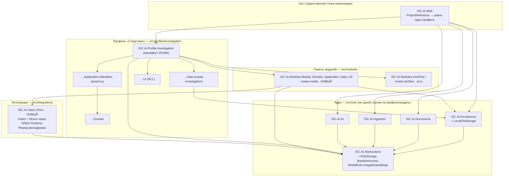
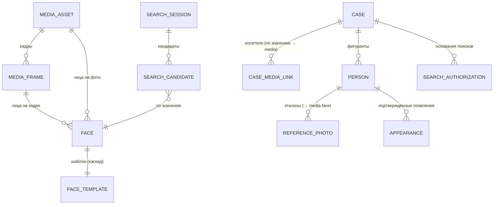
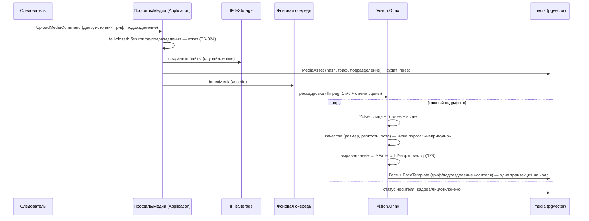

# Архитектура профиля «Следствие» («СледствиеAI») — ДОК-13

| | |
|---|---|
| **Класс документа** | Описание архитектуры (дополнение к ДОК-02 «Архитектура ISC.AI») |
| **Версия** | 0.1 (черновик для согласования), 17.09.2026 |
| **Основание** | ДОК-12 ТЗ профиля «Следствие»; ДОК-01, ДОК-02, ADR-0001..0017, ADR-0018..0023 (порты ядра под медиа, векторный поиск лиц, стек распознавания, выбор профиля при сборке, сессии поиска и правило двух лиц, пакет администрирования) |
| **Гриф** | Проект документа. При работе с реальными сведениями — ДСП |

> **Назначение.** Показывает, как второй профиль платформы — фото/видео, поиск по лицу, дела следствия — ложится на действующее ядро **без переписывания ядра**: что переиспользуется как есть, что добавляется в ядро нейтральными контрактами, что выносится в переиспользуемый пакет модулей «Медиа», что живёт только в профиле. Требования — по идентификаторам ДОК-01/ДОК-12; здесь — механизмы.

---

## Содержание

1. [Позиционирование и границы](#1-позиционирование-и-границы)
2. [Структура решения и правило зависимостей](#2-структура-решения-и-правило-зависимостей)
3. [Что переиспользуется из ядра как есть](#3-что-переиспользуется-из-ядра-как-есть)
4. [Нейтральные дополнения ядра (ADR-0018)](#4-нейтральные-дополнения-ядра-adr-0018)
5. [Пакет модулей «Медиа»](#5-пакет-модулей-медиа)
6. [Профиль «Следствие»](#6-профиль-следствие)
7. [Схема данных](#7-схема-данных)
8. [Конвейеры: индексация и поиск](#8-конвейеры-индексация-и-поиск)
9. [Верификация и HITL](#9-верификация-и-hitl)
10. [Стек распознавания и лицензии (ADR-0020)](#10-стек-распознавания-и-лицензии-adr-0020)
11. [Векторный поиск: метрика и HNSW (ADR-0019)](#11-векторный-поиск-метрика-и-hnsw-adr-0019)
12. [Режим и безопасность](#12-режим-и-безопасность)
13. [Развёртывание, размеры, поставка](#13-развёртывание-размеры-поставка)
14. [Качество и приёмка](#14-качество-и-приёмка)
15. [План реализации](#15-план-реализации)
16. [Риски и открытые вопросы](#16-риски-и-открытые-вопросы)

---

## 1. Позиционирование и границы

- **Второй профиль той же платформы.** Ядро ISC.AI (`Abstractions`, `AI`, `Ingestion`, `Documents`, `Persistence`, хост `Web`) остаётся общим; профиль подключается манифестом `IProfile` в трёх строках хоста (проверено на каркасе ЕРП-01: ядро — 0 строк). Цена появления профиля — правило, ради которого платформа строилась (ТС-003, ADR-0002).
- **Отдельный экземпляр развёртывания** (ADR-0006, ТС-010): своя БД `ISC_AI_INV`, своё хранилище, свой состав пользователей и допусков, свой контур. Инспекция и следствие не делят данные и не видят друг друга.
- **Новая модальность — вне ядра.** Всё, что знает о лицах, кадрах, ONNX и ffmpeg, живёт в пакете модулей «Медиа» и проекте интеграции; ядро получает только нейтральные порты (§4). Это сохраняет нейтральность ядра (тест `CoreNeutralityTests`) и позволяет подключить «Медиа» любому будущему профилю.
- **Не-цели** — по ДОК-12 §3.3: нет real-time наблюдения, нет вывода атрибутов по лицу, нет автоматической идентификации, нет выхода за контур.

## 2. Структура решения и правило зависимостей

Правило (ТС-002/009, закреплено `DependencyRulesTests`): ядро никогда не ссылается на профиль и модули; профиль и модули видят из ядра только `Abstractions`, а их `.Data` — ещё `Persistence`; хост ссылается ровно на один манифест профиля. Проект интеграции `ISC.AI.Vision.Onnx` зависит от `Abstractions` и от домена пакета `Media.Domain` (он реализует его порты — `IFaceDetector`, `IFaceEmbedder`, `IFrameExtractor`), но не видит ни профиля, ни хоста, ни `Persistence` — по образцу бывшего `src/integrations/ISC.AI.Identity.Skid`.

## 3. Что переиспользуется из ядра как есть

| Механизм ядра | Как используется профилем |
|---|---|
| `IAccessContextProvider` → `AccessContext(SubjectId, MaxClassification, AllowedDivisions)`, чтение допуска на каждую операцию (ТБ-012/016) | Тот же субъект, тот же допуск; область дел — дополнительное сужение профильной `IAccessPolicy` (ADR-0014) |
| `IClassified` + floor решётки «гриф ≤ допуск ∧ подразделение ∈ разрешённых» (ТБ-020/021) | Реализуют носитель, кадр, лицо, **шаблон**, дело, фигурант, поисковая сессия |
| `IAuditWriter`, `AuditBehavior<>` для `IAuditableRequest` (ТБ-030..032), `AuditAction` (Search/View/Ingest/Purge/Modify/Export) | Поиск по лицу — `Search` с чувствительной нагрузкой под решёткой; загрузка — `Ingest`; удаление — `Purge`; новых значений `AuditAction` не требуется (конкретика — в `ObjectRef`) |
| `IBackgroundTaskQueue` + `IBackgroundTaskStore` (`core.background_task`, восстановление после рестарта) | Индексация носителей: раскадровка → детекция → векторизация — фоном (ТНД-001), возобновляемо (ТНД-007) |
| `IIngestionPort` / `IRetriever` / `IGroundedGenerator` / грунтовка / чат / `IDocumentExporter` | Документы дела (через документооборот) → корпус ядра → чат «По документам», справки с грунтовкой и экспорт .docx с грифом (ТФ-ДДЛ, ТФ-ОТЧ) |
| Пакет модулей «Документооборот» (ADR-0017) с его портами (`IDivisionDirectory`, `IDocFlowAdministration`, `IAssignmentCandidateDirectory`) | Реализуются профилем «Следствие» так же, как «Инспектором»; документы дела = документы документооборота, привязанные к делу |
| Учётные записи, допуски, журнал аудита, смена своего пароля — пакет модулей `src/modules/admin` (ADR-0023); экспорт, офлайн-поставка (`deploy/offline`), OCR сканов | Профиль реализует три порта пакета (`IPlatformAdministration`, `IDivisionCatalog`, `IUserRoleCatalog`); роли и справочник подразделений — свои страницы профиля; роли — ТП-004, журнал аудита читает и Офицер ИБ |
| Образец раздачи файлов с проверкой решётки на выдаче (`DocFlowFileEndpoints` + `DocumentFileAccessResolver`, водяной знак PDF) | Копируется как образец для `MediaFileEndpoints` (фото/видео/вырезки) |

## 4. Нейтральные дополнения ядра (ADR-0018)

Ровно три вещи, ни одна не содержит доменных слов:

1. **Порт файлового хранилища** `ISC.AI.Abstractions.Storage.IFileStorage` — `SaveAsync(Stream, extension, category, subPath) → storedName`, `OpenReadAsync`, `DeleteAsync`. Сигнатура уже существует как модульный `IDocFlowFileStorage`; поднимаем контракт в `Abstractions`, реализацию `LocalFileStorage` (случайные имена, защита от обхода пути, `<Prefix>:Storage:BasePath`) — в `Persistence`. Документооборот затем переводится на общий порт; закрывается и известный пробел `IDocumentPurger` («файловый порт в ядре отсутствует»).
2. **Floor решётки в `Abstractions`**: `BaselineAccess.Filter<T>` (только `System.Linq.Expressions`, EF не нужен) переезжает из `ISC.AI.AI.Security` в `ISC.AI.Abstractions.Security`, туда же `AllowAllAccessPolicy`. Сегодня документооборот держит **вторую копию** предиката, потому что на `ISC.AI.AI` ссылаться не вправе; векторы лиц потребовали бы третью. Один инвариант — одна реализация.
3. **Роль модели `ModelRole.ImageEmbeddings`** (нейтральное «векторизация изображений», не «лица») и keyed-контракт `IEmbeddingGenerator<DataContent, Embedding<float>>` — оба типа уже есть в `Microsoft.Extensions.AI.Abstractions`, новых пакетов в `Abstractions` не нужно. Через `IModelContributor` профиль/модуль регистрирует свой векторизатор под этой ролью; ядро названий моделей не знает (ТО-прог-02/12). `AirGapEndpointGuard` делается публичным на случай выноса инференса на отдельный узел.

Чего в ядро **не вносится**: детекция лиц, ONNX Runtime, ffmpeg, сущности «носитель/лицо/шаблон», расширение `IRetriever`/`IIngestionPort` «под медиа» (они текстовые по контракту и покрыты GATE-1/2/3).

## 5. Пакет модулей «Медиа»

`src/modules/media/ISC.AI.Modules.Media{,.Domain,.Application,.Data,.UI}` — по образцу документооборота (ADR-0017): не зависит от профиля и хоста, схема `media` со своей историей миграций, манифест `MediaModule` со списками `Modules`, `ShellWidgets`, `RequiredServices`, `ConfigurationKeys`, `RegisterServices/RegisterDataContexts/MapEndpoints`.

**Домен (`Media.Domain`)**

| Сущность | Смысл | Ключевые поля |
|---|---|---|
| `MediaAsset` | Носитель (фото/видео) | `StoredName`, `Mime`, `ContentHash` (SHA-256 байтов), длительность/размеры, `Source`, `CapturedAt`, `Classification`, `DivisionId` (NOT NULL), `IsCurrent`, `UploadedBy`, `ModelVersion` |
| `MediaFrame` | Кадр видео | `AssetId` (FK), `TimestampMs`, `SceneChange` |
| `Face` | Обнаруженное лицо | `AssetId`/`FrameId`, `BBox`, `Landmarks5`, `DetScore`, `Quality`, `CropStoredName`, `TrackId` |
| `FaceTemplate` | Биометрический шаблон | `FaceId` (FK, каскад), `Vector` (`vector(128)`, константа `FaceTemplate.Dimensions`), `Classification`, `DivisionId` (NOT NULL, денормализованы), `IsCurrent`, `ModelVersion` |
| `SearchSession` | Поисковая сессия (ТО-инф-12) | Пробное изображение (ссылка в аудит), параметры, `ModelVersion`, область, кандидаты с баллами, статусы решений |

**Порты, которые модуль объявляет и реализует** (`Media.Domain.Services` → реализации в `Media.Data`/`Vision.Onnx`): `IFrameExtractor` (видео → кадры с таймкодами), `IFaceDetector` (изображение → лица с 5 точками и качеством), `IFaceEmbedder` (выровненное лицо → нормированный вектор), `IFaceQualityAssessor`, `IFaceSearch` (вектор + `AccessContext` + область + параметры → кандидаты), `IMediaPurger` (каскадное удаление с аудитом до), `IMediaFileAccess` (решётка на выдаче).

**Порты, которые обязан реализовать профиль** (`RequiredServices`, закрепляется `MediaContractTests`): `ICaseScope` — какие дела доступны субъекту и к какому делу привязан носитель (область поиска, ТБ-071); `IMediaAdministration` — кто вправе искать и менять настройки; `IVerificationPolicy` — правило двух лиц (ТБ-073) с ролями профиля. Без реализации приложение не стартует (ТС-013).

**Application**: `UploadMediaCommand : IAuditableRequest(Ingest)` (fail-closed без грифа/подразделения), `IndexMediaCommand` (ставит фоновую задачу), `SearchByFaceQuery : IAuditableRequest(Search)` (вход — пробное изображение или `FaceId`; выход — кандидат-лист), `RecordVerificationCommand` (решение одного субъекта; статус считает `IVerificationPolicy`), `PurgeMediaCommand : IAuditableRequest(Purge)`.

**UI (RCL)**: страницы носителя, поиска, очереди верификации; компоненты «видео с таймкодами лиц», «пара пробное ↔ кандидат» (равный масштаб, оригиналы, перечень применённых обработок — ТЭ-005..007). Сырой эндпоинт `GET /media/files/{category}/{parentId}/{storedName}` с резолвером доступа и водяным знаком на изображениях.

## 6. Профиль «Следствие»

`src/profiles/investigation/ISC.AI.Profile.Investigation{,.Domain,.Application,.Data,.UI}`, манифест `InvestigationProfile : IProfile` (`Id = "investigation"`), `Modules = [..свои, ..MediaModule.Modules, ..DocFlowModule.Modules]`, `ShellWidgets` из обоих пакетов, `RegisterServices` → свои + `MediaModule.RegisterServices` + `DocFlowModule.RegisterServices`, `RegisterDataContexts` → схема `investigation` + обе модульные, `MapEndpoints` → `MediaModule.MapEndpoints` + `DocFlowModule.MapEndpoints`.

**Домен**: `Case` (дело: номер, вид, статус, следователь, подразделение, гриф, основание), `Person` (фигурант: установочные данные или «неустановленное лицо №», роль в деле), `ReferencePhoto` (эталон фигуранта — ссылка на `media.face` по значению), `Appearance` (подтверждённое появление: фигурант ↔ лицо в носителе, статус «следственная версия»), `CaseMediaLink` / `CaseDocumentLink` (слабые ссылки в `media`/`docflow`), `SearchAuthorization` (основание поиска).

**Политика доступа**: `InvestigationAccessPolicy : IAccessPolicy` сужает floor ядра по делам субъекта (следователь — свои дела, руководитель — дела подразделения, эксперт — дела с назначенными ему поисками); реализация `ICaseScope` для модуля «Медиа» — то же правило.

**Меню (по логике рабочего дня)**: Дела · Фигуранты · Медиатека · Поиск по лицу · Верификация · Документы дела (документооборот) · Справки · Дашборд подразделения · Администрирование.

## 7. Схема данных

Одна БД экземпляра, схемы `core` (без изменений состава), `media`, `docflow`, `investigation` — у каждой своя история миграций, порядок накатки core → модули → профиль; FK только внутри схемы; через границу — ссылки по значению (ТО-инф-06/08).

Векторная таблица `media.face_template` (ТО-инф-09): `vector(128) NOT NULL`, `classification smallint NOT NULL`, `division_id int NOT NULL`, `is_current bool NOT NULL`, `model_version varchar`, FK `face_id` ON DELETE CASCADE; индексы — B-tree `(classification, division_id)` под pre-filter и HNSW `USING hnsw (vector vector_cosine_ops) WITH (m = 16, ef_construction = 512)`. Размерность — константа сущности (как `EmbeddingEntity.Dimensions = 768` в ядре): смена модели = миграция + полная переиндексация (ТО-мат-09).

Денормализация грифа/подразделения — на **каждую** строку носителя, кадра, лица и шаблона (ТБ-020/023): фильтр доступа — один `WHERE` рядом с вектором, без джойнов через схемы; прямой доступ к таблице подчиняется решётке (подпроверка GATE-4).

## 8. Конвейеры: индексация и поиск

**Индексация носителя** (фон, `IBackgroundTaskQueue`):

Возобновляемость (ТНД-007): прогресс фиксируется по кадрам; повторный запуск пропускает обработанные (уникальность «кадр × область»); дедуп носителя — по хешу байтов.

**Поиск по лицу** (интерактивно, ТН-006):

1. `SearchByFaceQuery` с делом и основанием (без них — валидатор отклоняет, ТБ-071); аудит `Search` пишется поведением ядра при успехе, ошибке и отмене.
2. Пробное изображение → тот же конвейер (детекция → выбор лица → качество → выравнивание → вектор). Симметрия конвейера — обязательна (ТО-мат-05).
3. `IFaceSearch`: транзакция, `set_config('hnsw.ef_search', 200, true)`, `WHERE` floor решётки ∧ профильное сужение по делам ∧ `is_current`, `ORDER BY vector <=> :probe LIMIT N` (N — длина кандидат-листа, режим investigation; порог — индикатор).
4. Кандидаты (лицо, кадр, носитель, таймкод, балл, качество) → поисковая сессия → очередь верификации.
5. Шаблон пробного изображения не сохраняется в базу (ТБ-074); оригинал — только в чувствительной части аудита под решёткой.

## 9. Верификация и HITL

Состояния кандидата: `Кандидат` → (эксперт: подтверждён / отклонён / неопределённо) → (верификатор — слепо, без исхода эксперта) → итог по `IVerificationPolicy`: два «подтверждён» разных субъектов → `Подтверждён (следственная версия)`; иначе `Отклонён` или `Неопределённо` с эскалацией руководителю. Ни один процесс не меняет статус автоматически; попытки нарушить правило двух лиц отклоняются и аудируются (GATE-5). Подтверждение создаёт `Appearance` у фигуранта. Протокол сравнения — экспорт .docx с грифом (ТФ-ВЕР-04). Процессуальное установление личности — вне системы (УПК ст. 209–211, 94).

## 10. Стек распознавания и лицензии (ADR-0020)

Правило проекта — только MIT/Apache-2.0, **включая веса моделей** (ТСТ-001/004). Проверено по первоисточникам 17.09.2026.

| Компонент | Роль | Лицензия кода / весов | Решение |
|---|---|---|---|
| **YuNet** (OpenCV Zoo, `face_detection_yunet_2023mar.onnx`, 338 КБ) | Детекция лиц: bbox + 5 точек + score | MIT / MIT | **Принять** |
| **SFace** (OpenCV Zoo, `face_recognition_sface_2021dec.onnx`, 37 МБ) | Вектор лица 128-d, вход 112×112 после выравнивания | Apache-2.0 / Apache-2.0 | **Принять**; остаточный риск — исследовательское происхождение обучающих данных, фиксируется в реестре |
| **Microsoft.ML.OnnxRuntime** (CPU) | Инференс ONNX в процессе | MIT | **Принять**; GPU-пакеты (CUDA/cuDNN EULA, DirectML) — только отдельным согласованием |
| **FFMpegCore** + бинарник **ffmpeg (LGPL-сборка, BtbN «lgpl»)** | Раскадровка видео внешним процессом | MIT / LGPL-2.1+ | **Принять с обязательствами**: без GPL-кодеков, текст лицензии и предложение исходников в дистрибутиве; сборки gyan.dev (GPLv3) не брать |
| **SkiaSharp** (+ NativeAssets) | Декодирование/масштабирование изображений, аффинное выравнивание | MIT / нативный Skia BSD-3 | **Принять** (BSD-3 зафиксировать как эквивалентно-пермиссивную) |
| **Magick.NET** | TIFF/HEIC/RAW при необходимости | Apache-2.0 / ImageMagick License | Принять при потребности; без Ghostscript |
| OpenCvSharp4 (`.runtime.win.slim`) | Альтернатива: готовые `FaceDetectorYN`/`FaceRecognizerSF` | Apache-2.0 | Запасной путь для быстрого старта; полный рантайм тянет статически слинкованный LGPL-ffmpeg — только `.slim` |
| InsightFace buffalo/antelope, SCRFD, RetinaFace (веса InsightFace), ArcFace из ONNX Model Zoo | — | код MIT/Apache, **веса — non-commercial research only** | **Запрещены** (ТСТ-004) |
| AdaFace, facenet-pytorch | — | код MIT, веса без лицензии / на некоммерческих датасетах | Запрещены без заключения юриста |
| SixLabors.ImageSharp, Xabe.FFmpeg, Emgu CV | — | split / CC BY-NC-SA / GPLv3 | **Запрещены** |

Реализация — «вариант A»: чистый ONNX Runtime + своя пред/постобработка (priors и NMS YuNet, similarity-transform по 5 точкам под SFace) — минимальный footprint и полный контроль зависимостей; «вариант B» (OpenCvSharp) — как ускоритель прототипа. Стартовые пороги SFace из OpenCV (cosine ≥ 0,363 на LFW) — только точка отсчёта; рабочие пороги — по пилоту (ТО-мат-08). Модели и ffmpeg поставляются как языковые файлы OCR платформы: скрипт экспорта с пинами SHA-256, манифест, регламент переноса (ТИ-004).

## 11. Векторный поиск: метрика и HNSW (ADR-0019)

- Шаблоны L2-нормированы → косинусная схожесть ≡ скалярное произведение; opclass `vector_cosine_ops`, оператор `<=>` — единообразно с ядром; оператор в запросе обязан совпадать с opclass, иначе seq-scan.
- Параметры — **урок инцидента 26.08.2026** (`docs/reference/pgvector-hnsw-recall.md`): дефолтная сборка HNSW теряла «острова» — малые группы непохожих векторов, и документ не находился даже при `ef_search=1000`; лечила только пара `ef_construction=512` при сборке + `ef_search=200` на транзакцию поиска. Для лиц это критично: редкое лицо среди тысяч чужих — ровно такой остров, а пропуск существующего совпадения для следствия недопустим (ЦС-02). Те же параметры — стартовые.
- Контрольная проба полноты — по методике платформы: одним вектором сравнить точный топ-K (`SET LOCAL enable_indexscan = off`, явно `enable_seqscan/sort = on`) и индексный; критерий — пересечение ≥ K−1 и совпадение топ-1; выполняется после массовой загрузки, миграции индекса, смены модели (ТО-мат-08).
- Масштаб: 128-d × 4 байта ≈ 0,5 КБ на шаблон — 1 млн шаблонов ≈ 0,5 ГБ данных, индекс сопоставим; на порядок легче текстового корпуса (768-d). `maintenance_work_mem` под граф, pgvector ≥ 0,8.4, REINDEX + проба после массовой доливки с VACUUM (известная гонка INSERT+VACUUM).
- Пороги и баллы привязаны к `model_version`; смена модели — переиндексация (ТО-мат-09).

## 12. Режим и безопасность

Наследуется всё из ДОК-01/ДОК-03. Специфика биометрии (ТБ-070..078) реализуется так:

| Требование | Механизм |
|---|---|
| Шаблон — спецкатегория (ТБ-070) | `FaceTemplate : IClassified`, гриф ≥ грифа носителя, NOT NULL; без грифа шаблон не создаётся |
| Поиск только в рамках дела и основания (ТБ-071) | Валидатор `SearchByFaceQuery` требует `CaseId` + `AuthorizationRef`; область — через `ICaseScope`; расширение области — отдельное событие аудита |
| Аудит поиска (ТБ-072) | `IAuditableRequest(Search)`: метаданные (субъект, дело, основание, модель, параметры) — доступны офицеру ИБ; `PayloadSensitive` (пробное изображение, кандидат-лист с баллами) — под решёткой (ТБ-032); срок хранения ≥ срока дела и ≥ 6 мес. |
| Запрет автоматического решения (ТБ-073) | Статус меняет только `RecordVerificationCommand`; `IVerificationPolicy` требует двух разных `SubjectId`; GATE-5 |
| Хранение/удаление (ТБ-074) | Пробные шаблоны — в памяти на время запроса; закрытие дела → `PurgeMediaCommand` каскадом с актом; `IMediaPurger` пишет аудит **до** удаления (ТБ-064); GATE-6 |
| Запрет атрибутов и real-time (ТБ-075) | В реестре моделей — только детектор и векторизатор; нет источников потокового видео |
| Запрет экспорта шаблонов, водяной знак (ТБ-076) | Векторы не выдаются ни одним эндпоинтом; изображения — через `MediaFileEndpoints` с решёткой и штампом получателя; .docx — с маркировкой (ТБ-033) |
| Цепочка хранения (ТБ-077) | `ContentHash` на носитель и эталон, `UploadedBy/At`, смена эталона — событие аудита с сохранением прежнего |
| Оценка воздействия, акт (ТБ-078) | Организационно: входит в режим-гейт (ПОДГ-06/08/09); система не различает «пилот/бой» — различает Заказчик актом |

Модель угроз (ДОК-03) дополняется нарушителями: «сотрудник, ищущий вне своего дела» (ТБ-071 + аудит + область), «утечка пробного изображения/шаблона через экспорт» (ТБ-076), «подмена эталона фигуранта» (ТБ-077), «сговор эксперта и верификатора» (организационно: назначение верификатора руководителем, ТО-орг-04).

## 13. Развёртывание, размеры, поставка

- **Экземпляр**: хост `ISC.AI.Web` со сборкой профиля «Следствие», PostgreSQL + pgvector (своя БД), сервер инференса LLM платформы (для справок и чата по документам), CPU-узел для моделей лиц (внутри процесса хоста или отдельный узел за `AirGapEndpointGuard`).
- **Вычисления**: YuNet + SFace на CPU — десятки кадров/с на x64; 1 час видео при 1 к/с = 3600 кадров → минуты, не часы (ТН-007). GPU (тот же узел, что у LLM) — при массовой раскадровке; требует отдельного решения по лицензиям рантайма (§10).
- **Хранилище**: оригиналы — `IFileStorage` (`Media:Storage:BasePath`), ориентир 1–2 ТБ/год при 500 ч видео; кадры не хранятся постоянно (извлекаются по таймкоду при показе); вырезки лиц — малы; резервное копирование с шифрованием (ТБ-060/062).
- **Дистрибутив** (ТИ-001..004): приложение, миграции (core → media → docflow → investigation), `deploy/offline/models/` (YuNet, SFace) и `deploy/offline/ffmpeg/` (LGPL-сборка + тексты лицензий + предложение исходников) с манифестами SHA-256 по образцу `export-tessdata.ps1`; при несовпадении хеша — индексация и поиск не стартуют (явная ошибка).
- **Конфигурация**: `Media:Models:Detector|Embedder` (пути, хеши, версия), `Media:Search:CandidateListSize|Threshold|MinQuality`, `Media:Video:SampleFps`, `Media:Storage:BasePath`, `Media:Ffmpeg:Path`; секретов нет.

## 14. Качество и приёмка

- Оценка по ISO/IEC 19795-1 на закрытом контуре: база размера, близкого к рабочему; пробные наборы реальных типов; TPIR(N, R, T) для R = 1, 5, 10, 20, 50 при T = 0; кривая TPIR/FPIR по порогам; FTE; разрез по демографическим группам местной популяции (ISO/IEC 19795-10) — КИ-05..09 (ДОК-12 §7.3).
- Режим по умолчанию — investigation (NIST FRTE): фиксированная длина списка, разбор человеком; пороговый режим — опция с порогом, ужесточаемым при росте базы (FPIR ≈ N·FMR).
- Gate-тесты GATE-4 (решётка на шаблонах), GATE-5 (нет автоматической идентификации), GATE-6 (каскадное удаление) — на Testcontainers PostgreSQL+pgvector; фикстуры — синтетические изображения, реальные фотографии в репозитории запрещены (ТО-прог-13).
- Операционные метрики из аудита: доля подтверждённых/отклонённых, доля расхождений эксперт↔верификатор — мониторинг качества и признак дрейфа.
- Повторная оценка — после каждой смены модели и не реже раза в год.

## 15. План реализации

По этапам ДОК-12 §6.2 (ЭС0..ЭС5, 3–4 месяца до пилота). Порядок кода — «сначала скелет, затем по одному модулю», каждая задача в ветке `feature/<задача>`:

1. **ЭС2-01** Нейтральные порты ядра: `IFileStorage` + `LocalFileStorage`, перенос `BaselineAccess` в `Abstractions` (документооборот — на общий floor), `ModelRole.ImageEmbeddings`; арх-тест — обобщить на второй профиль.
2. **ЭС2-02** `ISC.AI.Vision.Onnx`: YuNet/SFace через ONNX Runtime, выравнивание, качество; `FfmpegFrameExtractor`; модульные тесты на синтетике.
3. **ЭС2-03** `Modules.Media`: домен, схема `media`, `PgVectorFaceSearch` (транзакция + `ef_search`, floor + политика), `MediaPurger`, эндпоинт файлов; GATE-4/6, проба полноты.
4. **ЭС3-01** `Profile.Investigation`: дела, фигуранты, политика доступа, реализация портов «Медиа» и «Документооборота»; хост — 3 строки.
5. **ЭС3-02** Поиск и верификация в UI; GATE-5.
6. **ЭС3-03** Документы дела и справки (грунтовка, экспорт).
7. **ЭС4** Пилот: Evals, калибровка, нагрузочный тест, обучение.

## 16. Риски и открытые вопросы

| Риск / вопрос | Влияние | Мера |
|---|---|---|
| Качество SFace (лёгкая модель) на плохих ракурсах/освещении ниже, чем у ArcFace-класса, которые запрещены лицензией | Rank-k на CCTV-пробах может не дотянуть до желаемого | Калибровка на пилоте; требования к качеству проб; при недостаточности — поиск Apache/MIT-модели тяжелее класса (отдельный ADR), а не нарушение лицензии |
| Происхождение обучающих данных YuNet/SFace — исследовательские наборы | Остаточный правовой риск при формальной чистоте лицензий артефактов | Зафиксировать в реестре компонентов и ADR-0020; при необходимости — заключение юриста Заказчика |
| Правовая база: Закон об ОРД задаёт ОРМ, но не порядок (пороги, сроки, верификация) | Без ведомственного акта и оценки воздействия эксплуатация невозможна | ПОДГ-08/09 — на критическом пути; начать на ЭС1 |
| Демографические различия ошибок (NISTIR 8280) на местной популяции | Систематические ложные срабатывания для отдельных групп | КИ-08, разрез по группам на пилоте, компенсирующие меры в регламенте |
| Объёмы видео и хранилище | Рост стоимости хранения, время индексации | ТН-005 уточнить на ЭС1; кадры не хранить; GPU при необходимости |
| Соблазн «пороговой автоидентификации» в эксплуатации | Нарушение ТБ-073, ЦК ст. 194 | GATE-5 технически; регламент и обучение организационно |
| ffmpeg LGPL в поставке | Обязательства LGPL при передаче дистрибутива | Чек-лист ffmpeg.org/legal в ТИ-004; только LGPL-сборка, без GPL-кодеков |

---

*Конец документа. Версия 0.1 (черновик для согласования), 17.09.2026.*
