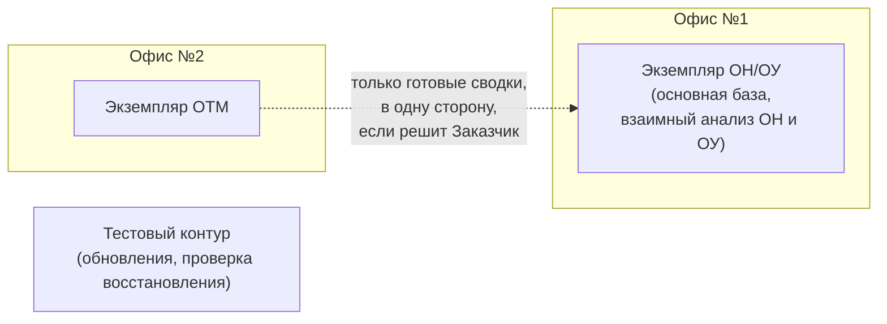
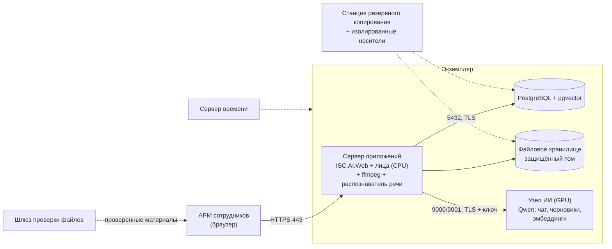

# Инфраструктура профиля «Следствие» (с учётом подключения модели Qwen)

| | |
|---|---|
| **Документ** | ДОК-14 |
| **Система** | ISC.AI — профиль «Следствие» («СледствиеAI»), пакеты «Медиа», «Документооборот», «Администрирование» |
| **Версия** | 0.3 (09.10.2026) — проект для согласования с Заказчиком |
| **Связь с ТЗ** | ТС-010, ТС-014, ТС-015, ТО-тех-03..05, ТН-005..009, ТНД-005, ТФ-МЕД-06, ТБ-024, ТБ-043, ТБ-044, ТБ-060, ТБ-062, ТБ-077, ТБ-080, ТБ-082, ТБ-083, ТИ-004; ТЗ Заказчика §1.2, §1.3, §2.1, §2.2 |
| **Связанные документы** | [Развёртывание профиля](Развёртывание_профиля_Следствие.md) (сборка, конфигурация, офлайн-поставка), [Архитектура профиля](Архитектура_Следствие.md) §13, ADR-0004, ADR-0006, ADR-0011, ADR-0019, ADR-0020, ADR-0026, ADR-0027 |

**История.** 0.1 — три рабочих экземпляра по ТЗ Следствия (ОН/ОУ и ОТМ в Офисе №1, ОУ-2 в Офисе №2).
0.2 — ОН, ОУ и ОТМ в обоих офисах, учтён накопленный архив около 10 ТБ. 0.3 — по уточнению от 09.10.2026:
**ОН и ОУ работают в одном офисе, ОТМ — в другом.** Это расходится с ТЗ Заказчика (там во втором офисе
группа ОУ-2), поэтому вариант ТЗ оставлен запасным (§3.1). Состав подтверждается у Заказчика (§13); после
подтверждения правится ТЗ Следствия (ТС-014, ТС-015, ТО-тех-05, Приложение В, вопрос 22).

> **Все цифры мощности — ориентир до замера.** По ТО-тех-05 состав и мощность серверов окончательно
> определяются замером на ЭС1 (ПОДГ-13). Здесь — стартовая конфигурация, рассчитанная от объёмов ТЗ, от
> накопленного архива и от того, как устроена система сейчас; методика замера — в §11.

## 1. Коротко

- **Три контура:** ОН/ОУ в Офисе №1, ОТМ в Офисе №2 и тестовый. ОТМ в другом здании — значит, изоляция от ОН/ОУ
  (ТС-014) обеспечена и физически: общей сети, серверов и хранилища у них нет. Если по ТЗ Заказчика в Офисе №2
  есть ещё группа ОУ-2, добавляется четвёртый экземпляр (§3.1).
- **В каждом рабочем экземпляре** — сервер приложений, сервер БД (PostgreSQL + pgvector) и файловое хранилище
  на защищённом томе. Распознавание лиц и речи работает **на процессоре**, видеокарта для них не нужна.
- **У ОТМ своя нагрузка — звук.** По ТЗ Заказчика ОТМ обрабатывает аудиоматериалы и технические каналы, поэтому
  у его сервера главная работа — расшифровка речи, а не поиск лиц в видео (§6).
- **Хранилище считается от накопленных 10 ТБ:** вместе с ростом по ТЗ на 5 лет это около **25–30 ТБ** полезного
  объёма на всю систему. Разбивка между ОН/ОУ и ОТМ — после того, как Заказчик скажет, где сколько лежит (§4.3).
- **Архив в 10 ТБ сейчас в систему не загрузить:** нет пакетного импорта, а файл больше 200 МБ не принимается.
  Это нужно доделать до ввода (§7). Обработка архива займёт **от нескольких недель до нескольких месяцев**
  фоновой работы — точнее покажет замер на образце.
- **Qwen живёт на отдельном узле ИИ с видеокартой**, свой у каждого офиса, которому он нужен: общий сервер ИИ
  стал бы каналом между ОН/ОУ и ОТМ (ТС-014). Сначала — Офис №1 (ОН/ОУ), ОТМ — по итогам пилота.
  **Минимальный узел** — одна серверная видеокарта 48 ГБ; **рекомендуемый** — 80–96 ГБ или две по 48 ГБ.

## 2. Исходные данные

| Параметр | Значение | Источник |
|---|---|---|
| Офисы и направления | Офис №1 — ОН и ОУ; Офис №2 — ОТМ | уточнение от 09.10.2026, **подтверждается** (в ТЗ Заказчика: Офис 1 — ОН, ОУ, ОТМ; Офис 2 — ОУ-2) |
| Накопленные данные | около 10 ТБ; состав (видео, фото, аудио, документы) и распределение между ОН/ОУ и ОТМ — **уточняется** | сведения от 09.10.2026 |
| Работа ОТМ | аудиоматериалы, технические каналы, биллинги | ТЗ Заказчика §1.3 |
| Учётные записи | до 100 на экземпляр | ТН-009; ТЗ Заказчика §2.2 |
| Одновременно работают | 10 рабочих мест на старте, рост до 50 | ТН-009 |
| Новые материалы | до 500 ч видео и до 100 000 фото в год на экземпляр ОН/ОУ | ТН-005 |
| Эталонная база лиц | до 1 000 000 шаблонов | ТН-005 |
| Рост хранилища | ориентир 1–2 ТБ в год для ОН/ОУ (кадры видео не хранятся, извлекаются при показе); для ОТМ — уточняется | ТО-тех-04 |
| Хранилище | не менее 20 ТБ | ТЗ Заказчика §1.2 |
| Индексация видео | 1 ч видео — не дольше 15 мин на процессоре | ТН-007 |
| Расшифровка речи | не медленнее 0,2 длительности записи на процессоре; замер — ~0,12 на 4 потоках (модель 600M) | ТН-007; ADR-0026 |
| Поиск по лицу | p50 ≤ 2 с, p95 ≤ 5 с по базе ТН-005 | ТН-006 |
| Резервные копии | не реже раза в месяц, полная копия БД и хранилища, зашифрованная, на изолированный носитель; проверка восстановления — раз в квартал | ТБ-082, ТБ-060 |
| Время | эталонный сервер времени внутри контура | ТБ-080 |
| Сеть | изолированный контур, без Интернета | ТЗ Заказчика §1.2; ТБ-050 |

## 3. Контуры и экземпляры

| Экземпляр | Назначение | Связь с другими |
|---|---|---|
| **ОН/ОУ Офиса №1** | основная база; ОН и ОУ работают в общей базе со взаимным анализом и поиском | доступа к ОТМ нет (ТС-014) |
| **ОТМ Офиса №2** | база ОТМ | сети с Офисом №1 нет. Передача **готовых сводок** ОТМ в ОН/ОУ — только если её подтвердит Заказчик: пакетом на носителе, в одну сторону, через шлюз проверки файлов. Исходные материалы ОТМ не передаются (ТБ-083) |
| **Тестовый** | проверка обновлений и моделей, ежеквартальная проверка восстановления (ТБ-060) | данные — только из резервной копии; если восстанавливаются реальные данные, контур подчиняется тем же режимным требованиям. Если проверяются копии обоих офисов — по очереди, с очисткой между проверками |

Почему передача сводок ОТМ — вопрос: в ТЗ Заказчика карточка объекта собирает сводки «от групп ОН, ОУ и ОТМ», но
там же сказано, что доступ ОН/ОУ к ОТМ «категорически запрещён». Без решения Заказчика канала между офисами нет.

### 3.1. Запасной вариант по ТЗ Заказчика

Если подтвердится, что в Офисе №2 работает ещё и группа ОУ-2 (ТЗ Заказчика §2.1), добавляется четвёртый
экземпляр — **ОУ-2 Офиса №2**: отдельно от ОТМ того же офиса, с собственными серверами и хранилищем, обмен с
ОН/ОУ Офиса №1 — экспортными пакетами (ТС-015, ТБ-083). Его мощности — как у ОТМ в таблице §6, но с упором на
видео и фото, а не на звук.

## 4. Состав одного экземпляра

### 4.1. Сервер приложений

Что на нём работает:

- хост `ISC.AI.Web` (Blazor Server) — интерфейс, сценарии, аудит, фоновая очередь индексации;
- распознавание лиц — модели YuNet и SFace **внутри процесса хоста, на процессоре** (ADR-0020); видеокарта не нужна;
- ffmpeg — раскадровка, проба видео, вырезка кадра при покадровом просмотре; до половины ядер одновременно
  (`Vision:Ffmpeg:MaxConcurrentFrameExtractions`, ADR-0028);
- распознаватель речи `ISC.AI.Speech.Worker` — отдельный процесс, **один одновременно**, 4–8 потоков (`Speech:Threads`, ADR-0026);
- временные копии материала дела (`TEMP` службы) — обязательно на защищённом томе (ТБ-062).

Основная нагрузка — процессор: индексация видео, расшифровка речи и вырезка кадров идут параллельно с работой
пользователей, а в первые месяцы — ещё и обработка архива (§7). Загружаемый файл держится в памяти целиком,
поэтому память нужна с запасом на одновременные загрузки.

**ОС.** Поставка сейчас проверена на Windows Server: скрипты поставки, ffmpeg (`win-x64`), распознаватель речи.
Перевод сервера приложений на Linux возможен (распознаватель уже собирается под `linux-x64`), но потребует
дописать поставку ffmpeg под Linux и прогнать проверки.

### 4.2. Сервер БД

PostgreSQL с расширением `pgvector`, одна БД на экземпляр, четыре схемы: `core`, `docflow`, `media`,
`investigation` (ADR-0006). Векторные индексы HNSW:

- шаблоны лиц — 128 чисел на лицо (SFace); 1 млн шаблонов — около 0,5 ГБ векторов и 1–1,5 ГБ с индексом;
- фрагменты документов и расшифровок для поиска по смыслу — 768 чисел на фрагмент (`vector(768)` в ядре).

База небольшая — десятки гигабайт даже с архивом; главное, чтобы векторные индексы помещались в память (поиск
по лицу p95 ≤ 5 с, ТН-006). Архив сразу наполнит базу шаблонов лиц и расшифровок, поэтому память сервера БД
берётся с запасом. Нужны быстрые NVMe-диски и `maintenance_work_mem` с запасом на построение HNSW
(`ef_construction=512`, ADR-0019).

### 4.3. Файловое хранилище

Оригиналы видео, фото и аудио, вырезки лиц, снимки кадров, ленты кадров (ADR-0038). Требования:

- защищённый том с шифрованием (ТБ-062), RAID с отказоустойчивостью (RAID 6 или RAID 10) и диском горячей замены;
- возможность расширения без остановки работы — объём будет расти с каждым годом;
- быстрый доступ с сервера приложений: ffmpeg читает оригинал на месте при покадровом просмотре (ADR-0028),
  поэтому хранилище подключается локально или по сети 10 Гбит/с.

**Как считать объём экземпляра на 5 лет:**

> (его часть архива × 1,1) + (рост в год × 5 лет) + 20 % запаса

Коэффициент 1,1 — производные: вырезки лиц, снимки и ленты кадров. Рост ОН/ОУ: 500 ч видео в год при
2–4 Мбит/с — 0,5–0,9 ТБ, 100 000 фото по ~3 МБ — 0,3 ТБ; итого 1–1,5 ТБ в год. Рост ОТМ (в основном звук) —
ориентир до 0,5–1 ТБ в год, уточняется.

| Пример | Расчёт | Полезный объём |
|---|---|---|
| ОН/ОУ получает 8 ТБ архива | (8,8 + 7,5) × 1,2 ≈ 20 ТБ | 20–24 ТБ |
| ОТМ получает 2 ТБ архива | (2,2 + 2,5..5) × 1,2 ≈ 8–9 ТБ | 8–10 ТБ |
| Вся система: 10 ТБ архива | (11 + 7,5 + 2,5..5) × 1,2 ≈ 25–28 ТБ | **25–30 ТБ на оба офиса** |

Отдельно на время переноса архива — **2–4 ТБ рабочего места** под копию принимаемых носителей (§7).

### 4.4. Узел ИИ — Qwen

См. §5.

### 4.5. Служебное оборудование

Нужно **в каждом офисе** — офисы не связаны сетью:

| Компонент | Зачем | Требование |
|---|---|---|
| Сервер времени (NTP) | метки времени журнала аудита (ТБ-080) | внутри контура; все серверы синхронизируются с ним |
| Внутренний удостоверяющий центр | сертификаты HTTPS и TLS к БД и к узлу ИИ (ТБ-044) | внутри контура |
| Станция резервного копирования + носители | ежемесячная зашифрованная копия (ТБ-082) | носители — не меньше двух комплектов по объёму данных; хранение раздельно с серверами |
| Шлюз проверки файлов | проверка материалов с внешних носителей до загрузки в систему (ТЗ Заказчика §1.3); через него же идёт архив | отдельная станция с антивирусом; базы обновляются офлайн-поставкой; при переносе архива — с быстрыми дисками и портами |
| АРМ администратора | управление серверами, офлайн-обновления | единственная точка удалённого управления серверами |
| ИБП | устойчивость к сбоям питания (ТНД-005) | на все серверы и сетевое оборудование; службы стартуют сами после восстановления питания |
| Станция подготовки поставки | **вне контура**, с Интернетом: скачивание моделей, пакетов, ffmpeg с проверкой SHA-256 (ТИ-004) | одна на оба офиса; переносится в контур только готовая папка `deploy/offline` |

## 5. Узел ИИ для Qwen

### 5.1. Что Qwen будет делать в «Следствии»

Сейчас профиль языковую модель не использует (ADR-0021). Qwen нужен для функций, которые уже заложены в
ТЗ и решения:

| Функция | Роль модели (ADR-0004) | Нагрузка | Основание |
|---|---|---|---|
| Пунктуация расшифровок («текст для чтения») | `Draft` | фоновая | ADR-0027 (проект) |
| Черновики сводок ОН и справок ОУ по данным дела | `Draft` | по запросу | Архитектура профиля §13; бланки ADR-0031 сейчас без ИИ — нужно отдельное решение |
| Чат по документам дела с проверкой ссылок по источникам | `Analysis` | интерактивная | ТФ-ДДЛ-02 |
| Поиск по смыслу в документах и расшифровках | `Embeddings` | фоновая (индексация) и по запросу | ТФ-ДДЛ-03 |
| Извлечение реквизитов из текста (ФИО, телефоны, госномера, адреса) как предложений для проверки | `Analysis` | фоновая | только после отдельного решения |

Для ОТМ, где главное — звук, полезнее всего пунктуация расшифровок и поиск по смыслу в них.

Правила, которые не меняются с приходом модели:

- Qwen ничего не решает сам: всё, что он предлагает, подтверждает человек, а ссылки проверяются по извлечённым
  фрагментам (инвариант грунтовки, ТБ-040). Каждое обращение пишется в журнал (ТБ-030).
- Qwen **не используется для опознания людей** — ни по фото, ни по видео (GATE-5). Модели «текст + изображение»
  (Qwen-VL) — только по отдельному решению и не для лиц.
- Текст расшифровок и документов — недоверенные данные: указания, произнесённые в записи, модель не выполняет (ADR-0027).

Подключение — **настройкой**: ядро работает с любым OpenAI-совместимым сервером через `IChatClient` (ADR-0011),
адреса и модели задаются ключами `Llm:Models:Draft|Analysis|Embeddings`. Но сами функции из таблицы выше ещё
предстоит реализовать — это работы, а не только установка сервера.

### 5.2. Какие модели

Конкретная версия Qwen выбирается на момент закупки по трём условиям: лицензия **Apache-2.0** (проверяется по
карточке конкретных весов — как было с GigaAM, «похожая» модель может оказаться под другой лицензией),
качество на русском и киргизском на пилоте, помещается в память выбранной видеокарты.

| Назначение | Класс модели | Почему |
|---|---|---|
| Основная (`Draft` и `Analysis`) | MoE ~30B параметров, ~3B активных (класс Qwen3-30B-A3B) | быстрая при хорошем качестве; помещается на одну карту 48 ГБ |
| Основная, если качества не хватит | плотная ~32B (класс Qwen3-32B) | точнее, но в 3–5 раз медленнее и требует больше памяти |
| Эмбеддинги (`Embeddings`) | Qwen3-Embedding 0.6B (при нехватке качества — 4B) | многоязычная; размер вектора задаётся, поэтому сохраняется `vector(768)` ядра — **без миграции схемы**, но с переиндексацией всего корпуса |
| Переранжирование (по желанию) | Qwen3-Reranker 0.6B | точнее порядок найденных фрагментов в чате |

Векторы разных моделей эмбеддингов несравнимы: смена модели — переиндексация корпуса (ADR-0011). Индекс HNSW
в pgvector принимает вектор до 2000 чисел, поэтому полные размеры старших моделей (2560 и 4096) без усечения
не годятся.

У Qwen3 есть режим «размышлений». Для документов он выключается (`Llm:DisableThinking`); как именно он
выключается у выбранной версии Qwen на нашем сервере — проверяется на пилоте.

### 5.3. Сервер инференса

- **Основной вариант — `llama-server` (llama.cpp, MIT).** Тот же движок, что у «ИнспектораAI»; модель в
  формате GGUF; несколько параллельных слотов; OpenAI-совместимый API на портах 9000 (чат) и 9001 (эмбеддинги).
  Число слотов согласуется с `Llm:MaxConcurrencyPerRole` (по умолчанию 4 на роль).
- **Если одновременных пользователей чата станет много** (десятки) — vLLM (Apache-2.0): выше пропускная
  способность, но нужен Linux, NVIDIA и отдельная офлайн-поставка Python-окружения. Код системы при этом не
  меняется — меняется только адрес в настройках.

### 5.4. Сколько нужно видеопамяти

Расчёт для 4 одновременных запросов с контекстом 32 000 токенов (чат по документам с грунтовкой):

| Вариант | Веса модели | Кэш контекста (4 × 32K) | Эмбеддинги + служебное | Итого | Подходящая карта |
|---|---|---|---|---|---|
| MoE ~30B, 4 бита | ≈ 19 ГБ | ≈ 12 ГБ | ≈ 3 ГБ | **≈ 34 ГБ** | 1 × 48 ГБ |
| MoE ~30B, 8 бит | ≈ 33 ГБ | ≈ 12 ГБ | ≈ 3 ГБ | ≈ 48 ГБ | 1 × 80–96 ГБ |
| Плотная ~32B, 4 бита | ≈ 20 ГБ | ≈ 32 ГБ | ≈ 3 ГБ | ≈ 55 ГБ | 1 × 80–96 ГБ или 2 × 48 ГБ |
| Плотная ~32B, 8 бит | ≈ 35 ГБ | ≈ 32 ГБ | ≈ 3 ГБ | ≈ 70 ГБ | 1 × 96 ГБ |

Кэш контекста можно хранить в 8 битах — он уменьшится вдвое, но качество ответов это нужно проверить.

**Нагрузка от потока новых материалов невелика:** 500 ч записей в год — порядка 10 млн токенов текста, пунктуация
годового объёма — десятки часов работы видеокарты. **Разовая нагрузка — архив:** если в 10 ТБ около 10 тыс. часов
речи, это до ~160 млн токенов, то есть 1–2 недели непрерывной фоновой работы видеокарты (оценка сверху). Поэтому
узел ИИ рассчитывается под **интерактивный чат**, а архив обрабатывается в фоне, по очереди и в нерабочее время.

### 5.5. Конфигурация узла ИИ

| | Минимум | Рекомендуется |
|---|---|---|
| Видеокарта | 1 × 48 ГБ, серверная, с ECC | 1 × 80–96 ГБ или 2 × 48 ГБ (вторая карта — фоновые задачи и эмбеддинги, чтобы они не тормозили чат) |
| Процессор | 16 ядер | 32 ядра |
| Память | 128 ГБ | 256 ГБ |
| Диск | NVMe 2 ТБ (веса нескольких версий моделей для отката) | NVMe 4 ТБ |
| ОС | Linux LTS (лучшая поддержка драйверов NVIDIA и движков); драйвер и CUDA — офлайн-пакетами | то же |

Модель видеокарты — по наличию у поставщика; главное — объём памяти, поддержка CUDA и серверное исполнение.

**Сколько узлов.** Два — по одному на офис; в запасном варианте с ОУ-2 — до трёх. Обязательный на первом
этапе — один, для ОН/ОУ Офиса №1 (§12).

### 5.6. Безопасность узла ИИ (ТБ-043, ТБ-044)

- Узел доступен **только** с сервера приложений своего экземпляра: межсетевой экран, TLS, ключ доступа к API.
  С рабочих мест сотрудников к нему подключиться нельзя — фильтр доступа применяется в хосте (ТБ-020).
- Тексты запросов и ответов **не пишутся** в технологические логи сервера инференса.
- Файл подкачки отключён или зашифрован; кэш контекста — только в памяти.
- Файлы моделей — только для чтения, с проверкой SHA-256 при поставке (ТИ-004).
- Один узел ИИ не обслуживает два экземпляра: у ОН/ОУ и у ОТМ — свой узел или узла нет.

## 6. Рекомендуемые мощности по экземплярам

| Экземпляр | Сервер приложений | Сервер БД | Хранилище (полезный объём) | Узел ИИ |
|---|---|---|---|---|
| **ОН/ОУ Офиса №1** | 32 ядра, 128 ГБ, 2 × 1 ТБ SSD (RAID 1; система и временные копии) | отдельный: 16 ядер, 128 ГБ, NVMe 2–4 ТБ (RAID 1/10) | по §4.3: 20–24 ТБ (не меньше 20 ТБ по ТЗ) | §5.5 — первым этапом |
| **ОТМ Офиса №2** | 24–32 ядра, 64–128 ГБ, NVMe 2 ТБ; приложение и БД на одном сервере, если сотрудников немного | на сервере приложений или отдельно — по числу сотрудников | по §4.3: 8–10 ТБ, уточняется по доле архива | свой узел — по итогам пилота, иначе без функций Qwen |
| **Тестовый** | 16 ядер, 64 ГБ, NVMe 2 ТБ | — (на сервере приложений) | под восстановление БД и выборки файлов | не обязателен; модели проверяются на узле ИИ Офиса №1 до ввода |
| *ОУ-2 Офиса №2 (запасной вариант, §3.1)* | *16–24 ядра, 64–128 ГБ; приложение и БД на одном сервере* | *—* | *по §4.3, от своей доли архива* | *по итогам пилота* |

Почему так:

- **32 ядра у сервера приложений ОН/ОУ:** одновременно идут индексация видео, расшифровка (4–8 потоков),
  вырезка кадров (до половины ядер), работа до 50 пользователей, а первые месяцы — обработка архива (§7).
- **У ОТМ упор на расшифровку речи.** Сейчас одновременно работает один распознаватель; если звука у ОТМ
  много (а по ТЗ Заказчика это его основная работа), понадобятся два–три распознавателя параллельно — это
  доработка, и под неё сервер ОТМ берётся на 24–32 ядра. Другой путь — расшифровка на видеокарте узла ИИ ОТМ;
  он требует отдельной проверки лицензий: GPU-пакеты рантайма идут под лицензиями NVIDIA (CUDA/cuDNN), а не MIT
  (Архитектура профиля §10).
- **Отдельный сервер БД у ОН/ОУ** — чтобы фоновая обработка медиа не тормозила поиск и чтобы БД можно было
  обслуживать отдельно. В малых экземплярах это не окупается.
- Серверы приложений и БД можно ставить виртуальными машинами на одном физическом хосте экземпляра. Узел ИИ
  лучше ставить без виртуализации, на «железо»: проброс видеокарты в ВМ усложняет поставку.

## 7. Перенос накопленного архива (около 10 ТБ)

### 7.1. Чего сейчас не хватает в системе

Архив такого объёма через обычную загрузку в браузере не перенести. До ввода нужно сделать:

| Что | Сейчас | Нужно |
|---|---|---|
| Пакетный импорт с носителя (каталог или архив с манифестом) | нет (ТФ-МЕД-06, приоритет P2) | поднять приоритет и сделать до переноса |
| Большие файлы | файл больше 200 МБ не принимается, файл держится в памяти целиком | приём потоком, без загрузки в память, для файлов в несколько гигабайт |
| Привязка к делам | каждый носитель загружается в дело вручную, гриф и подразделение подтверждает человек (ТБ-024) | правила сопоставления структуры папок Заказчика с делами; подтверждение грифа и подразделения пачкой, с записью в журнал |
| Скорость обработки | фоновая очередь индексирует по одному носителю, распознаватель речи — один | для архива — параллельная обработка нескольких носителей и записей (по замеру) |
| Документы (сводки, справки .docx) | загрузка по одному в документооборот | пакетная загрузка с индексацией |

Каждый файл архива получает SHA-256 до и после переноса и запись о том, кто и когда его ввёл (цепочка хранения,
ТБ-077). Дата съёмки переносится из исходных данных там, где она известна. Архив ОТМ загружается только в
экземпляр ОТМ, архив ОН/ОУ — только в экземпляр ОН/ОУ, каждый через шлюз своего офиса.

### 7.2. Сколько займёт обработка

Ориентир, если 10 ТБ — в основном видео (1–2 ГБ на час записи), то есть 5–10 тыс. часов:

| Обработка | Скорость | Время для 5–10 тыс. ч |
|---|---|---|
| Поиск лиц в видео | по ТН-007 не дольше 15 мин на час видео; по оценке архитектуры — несколько минут | от 2 недель до 3–4 месяцев непрерывной фоновой работы одного сервера |
| Расшифровка речи | ~0,12 длительности записи на 4 потоках, один распознаватель одновременно | 600–1200 ч, то есть 1–2 месяца непрерывно (только записи со звуком) |
| Пунктуация и эмбеддинги (Qwen) | §5.4 | 1–2 недели работы видеокарты (оценка сверху) |

Поиск лиц и расшифровка идут параллельно, поэтому общий срок — по самому долгому. У ОТМ архив, скорее всего,
в основном звуковой: аудиофайлы в разы меньше видео, поэтому часов записи на терабайт там больше и узким
местом станет расшифровка. Точную цифру даст замер на образце архива каждого офиса (§11).

### 7.3. Порядок переноса

1. Заказчик описывает состав архива каждого офиса: сколько видео, фото, аудио и документов, как разложено по
   папкам (по делам, по датам), есть ли файлы больше 200 МБ.
2. Замер на образце архива — точный срок обработки и нужная мощность.
3. Перенос по очереди: сначала действующие дела, затем остальное в фоне. Новые материалы обрабатываются в
   первую очередь и не ждут архива.
4. Для старого архива можно уменьшить частоту выборки кадров — обработка пойдёт быстрее, но лица в коротких
   эпизодах могут не найтись. Решает Заказчик.

## 8. Сеть

| Откуда | Куда | Порт | Примечание |
|---|---|---|---|
| АРМ сотрудников | сервер приложений | 443 (HTTPS) | единственный вход пользователей |
| сервер приложений | сервер БД | 5432 | TLS (`SSL Mode=Require`) |
| сервер приложений | узел ИИ | 9000, 9001 | TLS + ключ API; больше никто |
| все серверы | сервер времени | 123/udp | ТБ-080 |
| АРМ администратора | серверы | RDP / SSH | только с АРМ администратора |
| станция резервного копирования | БД, хранилище | по средству копирования | только на время копии |

- Правило по умолчанию — **всё запрещено**; Интернета нет; сети между офисами нет.
- Пользователи — 1 Гбит/с; сервер приложений ↔ хранилище ↔ БД — 10 Гбит/с (большие видеофайлы, перенос архива;
  покадровый просмотр читает оригинал).
- Хост работает за обратным прокси или напрямую; если за прокси — адрес клиента передаётся заголовком, это уже
  поддержано (`UseForwardedHeaders`), иначе в журнал попадёт адрес прокси, а не сотрудника (ТБ-080).

## 9. Резервное копирование и восстановление

- **По ТЗ:** раз в месяц полная копия БД и хранилища, зашифрованная открытым ключом Заказчика, на
  изолированный носитель (ТБ-082). Восстановление — двумя лицами: администратор и хранитель ключа. Проверка
  восстановления на тестовом контуре — раз в квартал (ТБ-060). Копии каждого офиса хранятся в своём офисе.
- **С архивом полная копия хранилища каждый месяц — это до 10–20 часов записи** на носитель и не меньше двух
  комплектов носителей. Оригиналы после загрузки не меняются, поэтому предлагаем: полная копия хранилища —
  раз в квартал или полгода, ежемесячно — только новые файлы; БД — полностью каждый месяц. Нужно согласие
  Заказчика: ТЗ требует ежемесячную полную копию.
- **Рекомендуем добавить** ежедневную копию БД на отдельный диск внутри контура: при одной ежемесячной копии
  авария может унести до 30 дней работы. БД небольшая, ежедневная копия занимает минуты.
- В копию входит и папка поставки (`deploy/offline` с моделями и манифестами): без неё систему не восстановить
  в изолированном контуре.

## 10. Обновления и поставка моделей

- Всё, что исполняется в контуре, готовится **вне контура** на станции подготовки, с закреплёнными SHA-256, и
  переносится через шлюз проверки файлов с записью в журнал переноса (ТИ-004, ТБ-051).
- Для Qwen нужен свой скрипт поставки (по образцу `export-vision-models.ps1` и `export-speech-models.ps1`): веса
  модели, файл эмбеддингов, сборка `llama-server`, тексты лицензий, манифест SHA-256. Его ещё предстоит написать.
- Драйвер NVIDIA и CUDA — офлайн-пакетами той версии, с которой проверен `llama-server`.
- Смена модели — это новые пины, повторная проверка качества и, для эмбеддингов, переиндексация корпуса.
- Поставка одна на оба офиса; в каждый офис она переносится отдельно, через его шлюз.

## 11. Замер на ЭС1 (что проверить до закупки)

1. Нагрузка 50 одновременных сеансов в браузере: время открытия дела и списка дел.
2. Индексация 1 ч видео при выборке 1 кадр/с — уложиться в 15 мин (ТН-007) при одновременной работе пользователей.
3. Расшифровка: коэффициент реального времени модели 600M на выбранном процессоре; для ОТМ — сколько записей в
   день нужно расшифровывать и хватает ли одного распознавателя.
4. Поиск по лицу на базе 1 млн шаблонов: p50 / p95 (ТН-006).
5. **Образец архива каждого офиса** — для ОН/ОУ 100 часов видео и сотня-другая фото, для ОТМ — сотня часов
   звука: скорость обработки и срок переноса всего архива.
6. Qwen: p50 / p95 ответа чата при 1, 4 и 8 одновременных запросах; качество на русских и киргизских документах
   и расшифровках Заказчика (по образцу пилота расшифровки речи).

## 12. Порядок закупки и работ

| Этап | Что | Что работает |
|---|---|---|
| **1** | серверы приложений, БД, хранилища под архив и служебное оборудование обоих офисов и тестовый контур; в системе — пакетный импорт и приём больших файлов (§7.1) | всё, что есть сейчас: дела, медиатека, поиск по лицу, расшифровка, верификация, документооборот, администрирование |
| **2** | перенос архива: замер на образце, затем действующие дела, затем остальное в фоне | архив доступен для поиска по мере обработки |
| **3** | узел ИИ ОН/ОУ Офиса №1; пилот Qwen на материалах Заказчика | пунктуация расшифровок, черновики сводок и справок, чат и поиск по смыслу — по мере реализации |
| **4** | узел ИИ ОТМ Офиса №2 — по итогам пилота и решению Заказчика | те же функции у ОТМ |

Этапы 2 и 3 можно вести одновременно. В серверах первого этапа стоит оставить запас: свободные слоты памяти и
отсеки дисков.

## 13. Что нужно уточнить у Заказчика

1. **Состав офисов:** Офис №1 — ОН и ОУ, Офис №2 — ОТМ? Есть ли в Офисе №2 группа ОУ-2, как написано в ТЗ
   Заказчика (тогда — запасной вариант §3.1)?
2. **Передача от ОТМ в ОН/ОУ:** передаёт ли ОТМ готовые сводки в карточки объектов ОН/ОУ (в ТЗ Заказчика
   карточка собирает сводки ОН, ОУ и ОТМ) — и если да, то как часто и в каком виде.
3. **Архив 10 ТБ:** сколько у ОН/ОУ и сколько у ОТМ; сколько в нём видео, фото, аудио и документов; как разложен
   по папкам; есть ли файлы больше 200 МБ.
4. **Объём работы ОТМ:** сколько часов звука в день или в месяц нужно расшифровывать.
5. Требования к ОС и сертификации: Windows Server или конкретный Linux.
6. Фактическое число одновременно работающих сотрудников в каждом офисе.
7. Нужен ли ИИ (Qwen) у ОТМ, и если нужен — с какого этапа.
8. Согласие на копии по §9: квартальная полная копия хранилища плюс ежемесячно новые файлы, ежедневная копия БД.
9. Кто хранитель ключей шифрования копий (и пакетов, если будет передача между офисами).
